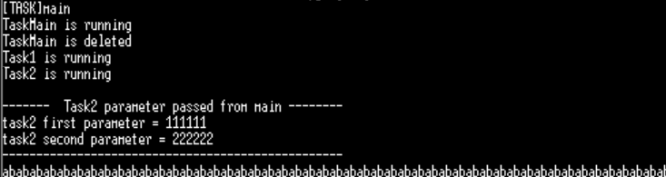
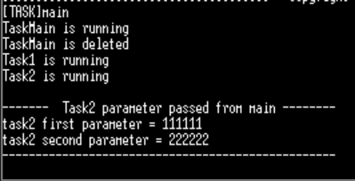
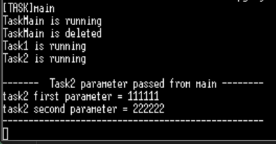

# TODO #1

- TASK2의 기본 설정
```c
#if 0
	char bbb[500]; // 800bytes(fail)
	UNUSED(bbb);
#endif
```
- 실행 결과
<br>

- TASK2 코드 수정 1
- 수정 내용: TASK2에 할당된 제한된 스택 공간(512바이트)중 약 절반에 해당하는 500바이트를 `bbb` 배열이 점유하게 함으로써, 으도적으로 stack overflow가 발생하도록 유도하고 있다.
```c
#if 1
	char bbb[500]; // 800bytes(fail)
	UNUSED(bbb);
#endif
```
- 실행 결과
	문제 없이 동일하게 실행됨

결론: 수정 전과 수정 후에 출력결과의 변화가 없다.

# TODO #2

- TASK2 코드 수정 3
- 수정 내용: 선언한 배열에, 실제로 메모리에 값을 쓰도록 수정. 
```c
#if 1
		memset((void*)bbb, 'a', 500);
#endif
```
- 실행 결과
	문제 없이 동일하게 실행됨. 아직 사이즈가 스택 공간을 넘지 않아서 큰 문제는 없는 것 같다.

- TASK2 코드 수정 3
- 수정 내용: 배열의 크기를 증가시킨다. 500->540
```c
#if 1
	char bbb[540]; // 800bytes(fail)
	UNUSED(bbb);
#endif
```
- 실행결과
<br>
	<br>stack overflow가 발생하여 결과가 출력되지 않는다.

# TODO #3
>Stack overflow 검사 도구 사용해보기

```c
스택 검사 옵션을 다음과 같이 설정한다
#define configCHECK_FOR_STACK_OVERFLOW           1
#define configCHECK_FOR_STACK_OVERFLOW           2

//#define configCHECK_FOR_STACK_OVERFLOW           2
```
- 옵션이 1,2번 2개 있는데 1번은 현실성이 별로 없어서 2번을 사용하는 것이 좋지만 2번도 완벽히 stack overflow를 발견하지는 못한다

### 2번 옵션을 활성화하고 디버깅 모드 진입
실행 결과:
<br>
- stack overflow를 찾아내지 못함
- 실행 됐어야 하는 코드
```c
void vAssertCalled( const char *pcFile, unsigned int ulLine )
{
  taskDISABLE_INTERRUPTS();
  printf("\n\nAssertion failed in %s:%d\n", pcFile, ulLine); for(;;);
}
```

[Task_and_Stack_memory](../Theory/Task_and_Stack_memory.md.md) - 런타임 스택 검사 방법 2가지(line 26)