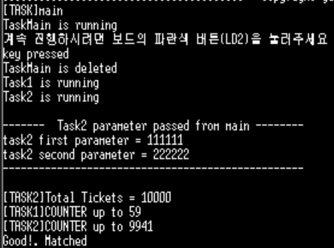
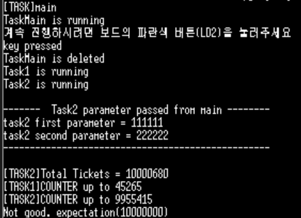
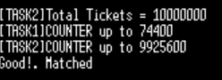
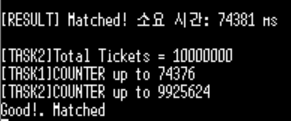
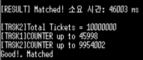

FreeRTOS의 커널 서비스인 [taskENTER_CRITICAL()](../FreeRTOS_reference_Manual/taskENTER_CRITICAL().md), [taskEXIT_CRITICAL()](../FreeRTOS_reference_Manual/taskEXIT_CRITICAL().md) 함수를 사용하여 임계영역의 공유자원을 보호하는 방법을 구현해보고 의미를 알아보자.
이 실습은 가상의 비행기 티켓 무인 발급 시스템을 가정하고 만들어진 실습이다.
비행기 티켓수(tickets) 자료를 2개의 태스크가 공유하여 작동시 발생되는 문제점과 그 해결 방법을 고민해본다.
# TODO #1
> 이후의 TODO#2를 위한 사전 준비이다.

- 수정 전 코드
```c
#define TICKET_1MILLION 1000000
#define TICKET_10000 10000
#define TICKET_1000 1000

	/* TODO #1:
		초기 티켓수를 작은수(1,000 ~ 10,000정도) 입력 하여 테스트 한후
	    그 결과를 설명한다 */
#if 1 // No comment
	tickets= backupTickets = 1 * TICKET_10000; // MAX value( 10 million )
#endif // TODO #1
```
실습 내용: tickets 변수에 초기값으로 10,000~100,000 정도를 입력한 후 어떤 결과가 출력되는지 확인한다. "Good!. Matched" 메시지가 보이면 성공

- 실행 결과
<br>
<br>정상적으로 출력됨을 확인

- tickets의 초기 값을 매우 큰 수로 변경 
```c
tickets= backupTickets = 10 * TICKET_1MILLION;
```

- 실행 결과
<br>
<br> 출력된 총 ticket 수가 최초 설정한 값과 다름을 통해 collison이 발생했음을 알 수 있다.

[임계 영역(Critical Section)](../Theory/CRITICAL_SECTION.md) - 동시성 문제

- 실행결과 분석: 
	tickets는 공유 자원인데 비원자적 연산이 보호 없이 수행되고 있다.
	`tickets++`-> '++'는 c에서는 단 한줄이지만 어셈블리어로 보면 총 5줄(3단계)의 연산 과정을 거치게 된다. 따라서, tickets의 값이 증가할수록 collison이 일어날 확률이 증가하여 "Not good..."이 출력된 것이다.

------------------
<br>

# TODO #2

`TODO #1`을 통해 현재 코드에는 잠재적인 위험(비원자적 연산)이 존재하는 것을 알게 되었다. 이를 해결하기 위해 `taskENTER_CRITICAL()`, `taskEXIT_CRITICAL()` 함수를 사용하면 임계 영역을 보호하여 비원자적 연산이 수행되는 동안 인터럽나 스케줄링으로 부터 안전한지 확인하여보자.

- 코드 수정: `buyTicket` 함수에 임계영역 생성을 위한 코드 작성
```c
int buyTicket(void)
{
	/* TODO #2:
		taskENTER_CRITICAL() 과  taskEXIT_CRITICAL()을 이용하여
		공유변수(tickets)를 보호한다 */
#if 1
// CRITICAL SECTION(ENTER)
	taskENTER_CRITICAL();
#endif // TODO #2

	tickets --;	// ticket count

#if 1
// CRITICAL SECTION(EXIT)
	taskEXIT_CRITICAL();
#endif // TODO #2

	return(tickets);
}
```

- 실행 결과
<br>
- 680의 오차가 있었던 `TODO #1`과 달리 오차 없이 출력되었다.
  
- 동작 원리:
	- `taskENTER_CRITICAL()`을 호출하면 CPU의 인터럽트가 금지된다 
	- 인터럽트가 금지되면 Tick Interrupt가 발생하지 않아 Context Switch도 일어나지 않는다.
	- 즉, 해당 구간은 현재 실행중인 태스크가 CPU를 독점하게 된다.
-----------------------
<br>

# TODO #3

`TODO #2` 실습은 `TODO #1`에 비해 굉장히 결과 출력에 오랜 시간이 걸렸다. CRITICAL SECTION 커널 서비스를 자주 호출하는 경우와 그렇지 않은 경우에서 걸리는 시간 차이를 확인해보자.

- 코드 수정
```c
// 시간 측정을 위한 전역 변수 추가 
TickType_t startTime, endTime;

// (Task Main) 티켓 구매 시작 전 시간 기록  
startTime = xTaskGetTickCount(); 
printf("측정을 시작합니다 "); 
fflush(stdout);

//(TASK1,2) 종료 시간 측정 및 계산 함수 추가
endTime = xTaskGetTickCount(); // 종료 시간 기록
printf("\n[RESULT] Matched! 소요 시간: %ld ms\n", (endTime - startTime));
```

- 임계 영역 사용시 결과
<br>

- 임계 영역 사용하지 않고 실행시 결과
<br>

- 결과 분석: 
	`74381/46003=1.6`으로 임계 영역 보호 코드 사용시 약 1.6배 정도의 시간이 더 걸리는 것을 확인 할 수 있다. <br>이를 통해 정확성과 실행 속도 사이의 트레이드 오프를 이해하고 구현하려는 시스템에서 어떤 부분이 더 중요할지 개발자가 잘 이해하고 사용하는 것이 중요할 것 같다. 또한 `taskENTER_CRITICAL()`함수 사용 시 인터럽트가 차단되는데 하드리얼타임에서는 선점을 통한 즉각적인 반응이 중요하기 때문에 임계영역 내부에서 오랫동안 코드가 실행되지 않도록 주의해야 한다고 생각한다..
