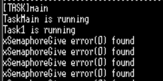
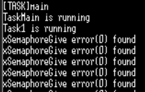
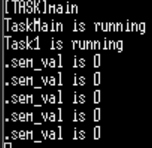
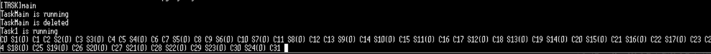
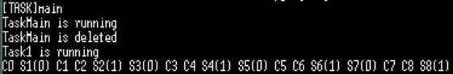

# 05_SEMAPHORE
## TODO #1

- 실습 내용
	1. 세마포어 생성 함수를 구현한다.
	2. 컴파일하고 실행하여 원하는 결과가 출력되는지 확인한다.
	3. 터미널 창에 별도의 에러 메시지가 보이지 않는 다면 성공
```c
/* TODO #1:  
	create a binary semaphore 
    use sem_id */ 
#if 1
	sem_id=xSemaphoreCreateBinary();
	if (sem_id == NULL) printf("xSemaphoreCreateBinary error found\n");
#endif // TODO #1
```

- 실행 결과

xSemaphoreGive error가 발견되었다.

- 이유 확인
```c
// loop counter
	loops = 10;
    for(;;) {
		// 세마포어 대기
		if (xSemaphoreTake(sem_id, portMAX_DELAY) == pdTRUE)
		{
			printf("."); fflush(stdout);
		}
		sem_val=uxSemaphoreGetCount(sem_id);
    	//printf("sem_val is %d\n", (int)sem_val);

		if(loops == 0)
			break; // exit

		loops--;
	}
```
`Task Main` 내부 코드에서 볼 수 있듯이. 세마포어를 획득했다면 터미널에 '.'이 찍혔어야 한다. 그러나 터미널에 '.'이 하나도 찍히지 않은것을 보아 휴면상태로 간것을 알 수 있다.
1. `xSemaphoreCreateBinary()`로 세마포어를 생성했기에 초기값은 0이다.
2. Task Main의 우선순위가 가장 높기 때문에 Main이 먼저 실행되었다.
3. `xSemaphoreTaske`는 세마포어 값이 0이므로 누군가 Give 해줄 때까지 blocking 상태로 진입하게 된다.
4. 결과적으로 '.'은 출력되지 않고 반복해서 에러를 뱉어내는 상태가 된다.

`TODO #2`코드에서 give 함수를 구현해야 한다.

## TODO #2

- 실습 내용
	give 함수를 구현하여 TaskMain이 정상적으로 동작하도록 한다.
```c
	/* TODO #2:
		post to a semaphore */
#if 1
		err = xSemaphoreGive(sem_id);
#endif // TODO #2

	if (err != pdPASS) printf("xSemaphoreGive error(%d) found\n", (int)err);
	vTaskDelay (pdMS_TO_TICKS (1000));
```

- 실행 결과
<br>
<br>TaskMain 내부 loop가 10번 반복하여 돌면서 '.'을 출력한 후 break 후 Task가 삭제된다. 이로 인해 다시 에러가 출력된다.
<br><br>
<br>또한, loop 내부에서 현재 sem_val를 얻기 위한 코드를 추가하였다.
<br>Binary로 세마포어를 생성하였기에 0 또는 1만을 가질 수 있다. 
<br>take 함수가 실행되는 순간 TaksMain은 blocking 상태로 변하고 이때, Task1이 실행되며 give 함수가 실행되어 세마포어 값이 1이되고, TaskMain이 깨어나게 된다. 이게 10번 반복된 후 세마포어가 삭제되고 give error가 출력된다.(최대값 도달시 fdFAIL 반환)

****
<br>

# 06_COUNT_SEM

- 동작 설명
```c
SemaphoreHandle_t sem1; // 세마포어 선언
...
sem1=xSemaphoreCreateBinary(); // 세마포어 초기화
// sem1 = xSemaphoreCreateCounting( 10, 0 );
...
/*세마포어가 존재하면 counter 증가*/
if(xSemaphoreTake( sem1, portMAX_DELAY ) == pdTRUE){counter++;}

/*버튼 인터럽트가 발생하면 ISR에서 Give 함수가 동작한다.*/
	// Semaphore 'Give Blocked Task Unblock'
	xSemaStatus = xSemaphoreGiveFromISR( sem1, &xHigherPriorityTaskWoken );
	portYIELD_FROM_ISR(&xHigherPriorityTaskWoken);
```
1. Take 함수가 호출되고 Task1이 blocking 상태로 들어감
2. 버튼 인터럽트가 눌리면 ISR 실행
3. ISR 내부에서 Give 함수 실행
4. Task1이 깨어나고 counter 증가

- 실행 결과

버튼 인터럽트 누를 때 마다 횟수가 출력됨,

****
## 버튼 키 인터럽트의 처리 단계

1. 버튼을 누른다
2. GPIO 인터럽트 발생
3. `EXTI15_10_IRQHandler`함수 실행
4. `HAL_GPIO_EXTI_IRQHandler`함수 실행
5. `HAL_GPIO_EXTI_Callback`함수 실행

- `.word EXTI15_10_IRQHandler`
	0으로 변경 시 버튼 인터럽트 실행 안됨.
```c
void EXTI15_10_IRQHandler(void)
{
  /* USER CODE BEGIN EXTI15_10_IRQn 0 */

  /* USER CODE END EXTI15_10_IRQn 0 */
  HAL_GPIO_EXTI_IRQHandler(USER_Btn_Pin);
  /* USER CODE BEGIN EXTI15_10_IRQn 1 */

  /* USER CODE END EXTI15_10_IRQn 1 */
}
```

- `stm32f7xx_hal_gpio.c`
```c
void HAL_GPIO_EXTI_IRQHandler(uint16_t GPIO_Pin)
{
  /* EXTI line interrupt detected */
  if (__HAL_GPIO_EXTI_GET_IT(GPIO_Pin) != RESET)
  {
    __HAL_GPIO_EXTI_CLEAR_IT(GPIO_Pin);
    HAL_GPIO_EXTI_Callback(GPIO_Pin);
  }
}
```

- `task.c`
```c
void HAL_GPIO_EXTI_Callback(uint16_t GPIO_Pin)
{
  /* Prevent unused argument(s) compilation warning */
  UNUSED(GPIO_Pin);
  /* NOTE: This function Should not be modified, when the callback is needed,
           the HAL_GPIO_EXTI_Callback could be implemented in the user file
   */
  static portBASE_TYPE xHigherPriorityTaskWoken;
  portBASE_TYPE xSemaStatus;
  UNUSED(xSemaStatus);

#ifdef FREERTOS_MODULE_TEST
//	vLogicSniffMultiSetLED5(LS_CHANNEL_ALL5, 0); // All Leds Clear
//	vLogicSniffMultiSetLED6(LS_CHANNEL_ALL6, 0); // All Leds Clear
	vLogicSniffSetLED( LS_CHANNEL_7, 1 ); // LED 'ON'
#endif

	//printf("o"); fflush(stdout);
	printf("C%d ", (int)buttoncounter);fflush(stdout);
	buttoncounter++;

/* counting semaphore example12 */
	xHigherPriorityTaskWoken = pdFALSE;

	// 시간이 많이 소요되는 함수를 호출
	heavyCopyLoader();

	// Semaphore 'Give Blocked Task Unblock'
	xSemaStatus = xSemaphoreGiveFromISR( sem1, &xHigherPriorityTaskWoken );
	portYIELD_FROM_ISR(&xHigherPriorityTaskWoken);
}
```

****
- 세마포어 초기화 함수 변경
`sem1 = xSemaphoreCreateCounting( 10, 0 )` 세마포어 초기화 함수를 변경한다.


<br>`xSemaphoreCreateBinary()`일때는 `S(0)`만 나왔었는데 `S(1)`까지도 확인할 수 있었다. 코드의 속도가 너무 빨라서(`heavyCopyLoader()`를 넣었음에도) 그것보다 크게는 찍히지 않았다.