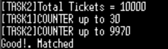
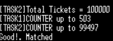
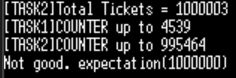
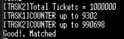

# TODO #1

FreeRTOS 의 커널 서비스인 뮤텍스 함수들을 사용하여 공유 자원을 보호하는데 이용해 보고 세마포어와의 차이점등을 비교해 본다

```c
/* TODO #1:
		create a mutex
	    use mutex_id */
#if 0
mutex_id = xSemaphoreCreateMutex(); 
// 바이너리 세마포어 처럼 사용하므로 인자를 넣지 않는다.
if (mutex_id == NULL) printf("xSemaphoreCreateMutex error found\n");
#endif // TODO #1
```

- 뮤텍스 생성 함수를 구현한다.

- **실행 결과:**

- 티켓 개수 10,000개
<br>
- 티켓 개수 100,000개
<br>
- 티켓 개수 1,000,000개
<br>

- 티켓 개수가 백만개가 되니 연산도 오래걸리고 총 티켓 수가 정확하게 나오지 않았다.

`if (mutex_id == NULL) printf("xSemaphoreCreateMutex error found\n");` << return 값 확인 코드이다.
심각한 오류라면 `printf()` 대신 assert함수를 사용한다

- assert 함수 예시
```c
void vAssertCalled( const char *pcFile, unsigned int ulLine )
{
  taskDISABLE_INTERRUPTS();
  printf("\n\nAssertion failed in %s:%d\n", pcFile, ulLine); for(;;);
}
```

------

# TODO #2

`butTicket()`함수에 뮤텍스 함수를 추가하여 race condition이 일어나지 않도록 한다.

```c
int buyTicket(void)
{
	/* TODO #2:
		MUTEX 을 이용하여
		공유변수(tickets)를 보호한다 */
#if 1
	// CRITICAL SECTION(ENTER)
	xSemaphoreTake(mutex_id, portMAX_DELAY);
#endif // TODO #2

	tickets --;	// ticket count

#if 1
	// CRITICAL SECTION(EXIT)
	xSemaphoreGive(mutex_id);
#endif // TODO #2

	return(tickets);
}
```
[xSemaphoreTake()](../FreeRTOS_reference_Manual/xSemaphoreTake().md), [xSemaphoreGive()](../FreeRTOS_reference_Manual/xSemaphoreGive().md) 함수를 추가하였다.

- **실행 결과:**
<br>
<br>똑같이 백만개로 실행하였고 좀 더 오랜시간이 걸렸지만 정확한 결과가 나왔다.