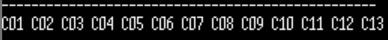
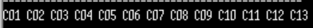
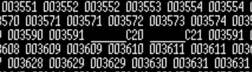
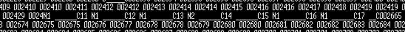

[Deffered Interrupt](../Theory/Defferred_Interrupt.md) 
<br>

# TODO #1

```c
  /* TODO #1 #3:
    상수 선언 __MY_ENABLE_DEFERRED_INTERRUPT 을 활성화 한다 */

#define __MY_ENABLE_DEFERRED_INTERRUPT  0
```
- 실습 내용: Deferred Interrupt가 비활성화 된 상태에서 코드 실행해보기
- 실습 결과: 버튼을 누르면 즉각적으로 화면에 값이 반영된다.
<br>
```c
void heavyCopyLoader(void)
{
	int i;

#if __MY_ENABLE_DEFERRED_INTERRUPT == 1
	// CRITICAL SECTION(ENTER)
xSemaphoreTake(mutex_id, portMAX_DELAY);
#endif // __MY_ENABLE_DEFERRED_INTERRUPT

	// 1.45MB의 데이터를 처리
	for(i=0; i<1450 /*14500*/; i++) 
	{
		//memcpy(b2,b1,BUFSIZE);
		memset(b2, copyTimes, BUFSIZE);
	}

	copyTimes++;  // 누적 처리 수
	printf("C%02d ", copyTimes); fflush(stdout);

#if __MY_ENABLE_DEFERRED_INTERRUPT == 1
	// CRITICAL SECTION(EXIT)
xSemaphoreGive(mutex_id);
#endif // __MY_ENABLE_DEFERRED_INTERRUPT

}
```
- 인터럽트 키를 누르면 실행되는 함수이다. 현재 1.45MB만큼의 데이터를 처리하는데 loop를 10배로 늘려 14.5MB의 데이터를 처리하도록 해보자.

- 실습 결과: 이전보다 반응도 더 늦고 짧은 시간안에 여러번 누르면 실제 누른 횟수보다 적게 출력된다. -> 인터럽트를 놓치게 된다.
<br>

<br>

# TODO #2

```c
  /* TODO #2:
    터미널 화면에 현재 시간 정보(Tick변수값)을 출력 */
#if 1 // No comment
		printf("%06d ", xTaskGetTickCount()); // 현재의 시간(xTickCount) 출력
		fflush(stdout);
#endif // TODO #2

		task2timer++;
```

- 실습 내용: 타이머 틱 인터럽트에 어떤 영향을 미치는지 확인해보자
- 실습 결과: 계속해서 증가하는 Tick 인터럽트가 버튼 인터럽트 내 메모리 처리 함수 때문에 영향을 받아 정상적으로 증가하지 못함. 003591 -> 003591
<br>

<br>

# TODO #3

```c
#define __MY_ENABLE_DEFERRED_INTERRUPT  1
```
- 실습 내용:Deferred Interrput를 활성화 시키고 `TODO #2`와 결과를 비교하여 보자
- 실습 결과: 002429->002655로 버튼 인터럽트가 눌려 인터럽트 루틴이 발생하는 동안에도 Tick 인터럽트가 정상적으로 동작했다는 것을 알 수 있다.
<br>

<br>

## task 코드 분석

```c
void HAL_GPIO_EXTI_Callback(uint16_t GPIO_Pin)
{
	static portBASE_TYPE xHigherPriorityTaskWoken;

#ifdef FREERTOS_MODULE_TEST
//	vLogicSniffMultiSetLED5(LS_CHANNEL_ALL5, 0); // All Leds Clear
//	vLogicSniffMultiSetLED6(LS_CHANNEL_ALL6, 0); // All Leds Clear
	vLogicSniffSetLED( LS_CHANNEL_7, 1 ); // LED 'ON'
#endif

	//printf("o"); fflush(stdout);
	buttoncounter++;

/* xHigherPriorityTaskWoken은 pdFALSE로 초기화되어야한다 */
	xHigherPriorityTaskWoken = pdFALSE; // 이 인터럽트 때문에 깨어난 태스크가 현재 실행 중인 태스크보다 우선순위가 높은지 판단하는 Flag이다.

#if __MY_ENABLE_DEFERRED_INTERRUPT == 0
	// 시간이 많이 소요되는 함수를 호출
	heavyCopyLoader();
#endif //__MY_ENABLE_DEFERRED_INTERRUPT

	// Task Notify
	vTaskNotifyGiveFromISR(xHandle1, &xHigherPriorityTaskWoken);
	// `xHandle1`이라는 핸들을 가진 태스크(Task1)에게 신호를 보낸다.
	portYIELD_FROM_ISR(&xHigherPriorityTaskWoken);
	// 태스크 알림: 만약 깨어난 태스크가 현재 작업보다 우선순위가 높다면(xHighPriorityTaskWoken이 pdTRUE가 되면), 인터럽트가 끝나자마자 바로 그 태스크로 점프하게 만든다.
}
```

[xHigherPriorityTaskWoken()](../FreeRTOS_reference_Manual/xHigherPriorityTaskWoken().md) 매뉴얼

### 코드 동작 방식

- **플래그 초기화 (`xHigherPriorityTaskWoken = pdFALSE`):**  이번 인터럽트로 인해 지금 당장 CPU 점유자를 바꿀 필요가 있는지 확인하기 위한 준비 작업이다.
    
- **부하 분산 (`#if` 조건문):** 인터럽트 안에서 직접 `heavyCopyLoader`)를 수행할지 아니면 나중에 수행할지를 결정한다. 
    
- **쪽지 전달 (`vTaskNotifyGiveFromISR`):** 세마포어보다 훨씬 가벼운 '태스크 알림' 기능을 사용하여 특정 태스크(`xHandle1`)의  신호를 전달한다.
    
- **즉시 교대 (`portYIELD_FROM_ISR`):** 만약 신호를 받은 태스크가 지금 실행 중인 태스크보다 더 우선순위가 높다면, 인터럽트가 끝나자마자 집으로 안 가고 바로 그 중요 태스크로 **즉시 문맥 전환**을 수행한다.