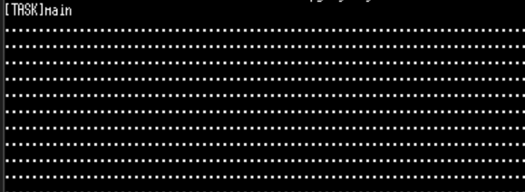
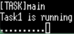
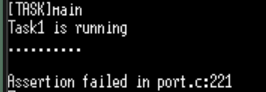

# TODO #1

- 이벤트 플래그 생성 함수를 사용해 이벤트 플래그를 생성한다.
```c
	/* TODO #1:
		create a event flag
	    use group_id */
#if 1
group_id= xEventGroupCreate();
if (group_id == NULL) printf("xEventGroupCreate error found\n");
#endif // TODO #1
```
- `xEventGroupCreate()`를 이용해 이벤트 플래그를 생성한다. 인자는 없으므로 아무것도 적지 않는다.

- 실행 결과
<br>
TASK MAIN 내부에 단순히 '.' 출력을 반복하는 함수로 인해 '.'이 반복해서 출력된다.

# TODO #2

```c
// 점을 받는 부분
	for(;;) {
	/* TODO #2:
		get flag 'ENGINE_OIL_PRES_OK' OR 'ENGINE_OIL_TEMP_OK' from TASK2 */
#if 1
uxBits = xEventGroupWaitBits(group_id,
							ENGINE_OIL_PRES_OK + ENGINE_OIL_TEMP_OK,
							pdTRUE,
							pdFALSE,
							portMAX_DELAY);
UNUSED(uxBits);
#endif // TODO #2

		printf("."); fflush(stdout);
	}
	
// 점을 보내는 부분
	for(;;) {
	/* TODO #2:
		post flag 'ENGINE_OIL_PRES_OK' to TASKMain */
#if 1
uxBits = xEventGroupSetBits(group_id, ENGINE_OIL_PRES_OK);
UNUSED(uxBits);
#endif // TODO #2
	vTaskDelay (pdMS_TO_TICKS (1000));
	}
```

- `xEventGroupWaitBits()`
	`pdTRUE`: 이벤트가 발생해서 이 함수를 빠져나갈 때, 해당 비트들을 다시 0으로 초기화한다.
	`pdFALSE`: 여러 비트 중 하나라도 세팅되면 실행된다. (OR연산)

- 동작 방식
	`xEventGroupSetBits()`에서 신호를 보내고, TASK MAIN의 `xEventGroupWaitBits()`가 신호를 받으면 다음 줄로 넘어가 '.'을 찍고 비트를 다시 초기화 한다.

- 실행 결과 (1) (점을 보내는 태스크 for 무한 루프 시)
<br>
<br>1초에 '.' 하나씩 출력된다.

- 실행 결과 (2) (점을 보내는 태스크 for 10회만 했을 때)
<br>

- **결과 분석:** 현재 무한루프였던 `for(;;)`문을 10번만 돌도록 설정했기에 태스크를 정상적으로 종료하기 위한 `vTaskDelete(NULL)`을 코드에 추가하지 않아서 Asser에러가 발생했어야 헀는데 아무것도 출력되지 않았다.

- **이유:** `FreeTOSConfig_base.h`의 `#define configASSERT( x ) if ((x) == 0) {taskDISABLE_INTERRUPTS(); for( ;; )` 때문이다.
 <br> 이 코드 한 줄은 `if((x)==0)`이면 즉, 입력값이 거짓이면 태스크가 종료되어 커널 내부적으로 `configASSERT(0)`을 호출하게 되어있다. 그러나 `taskDISABLE_INTERRUPTS()`가 CPU 인터럽트를 꺼버리기 때문에, OS의 심장박동인 틱 인터럽트도 멈추고 스케줄링도 중단된다. 따라서 CPU는 `for(;;)`에서 무한 반복만 하기 때문에 아무것도 터미널에 출력되지 않는 것이다.

- **오류 문구 띄우는 법:** `#define configASSERT( x ) if ((x) == 0) {vAssertCalled( __FILENAME__, __LINE__);}`으로 코드 내용을 변경하여 `main.c`내부에 있는 `vAssertCalled()` 함수를 호출한다. 오류 발생 시 미리 설정된 오류 문구를 통해 오류 발생 여부를와 어떤 파일에서 오류가 발생했는지 확인할 수 있다.
```c
void vAssertCalled( const char *pcFile, unsigned int ulLine )
{
  taskDISABLE_INTERRUPTS();
  printf("\n\nAssertion failed in %s:%d\n", pcFile, ulLine); for(;;);
}
```

- **오류 해결:** `vTaskDelete(NULL)`을 코드 마지막 부분에 추가한다.

