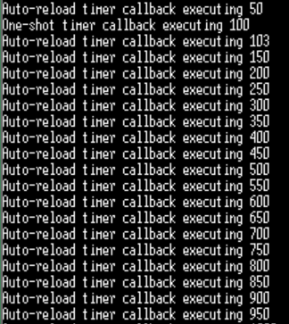

# TODO #1

- One-shot 타이머를 구현다
```c
/* TODO #1: 
   원샷 소프트웨어 타이머(xOneShotTimer)의 구현 */
#if 1
    /* 원샷 타이머를 생성하고, 생성된 타이머의 핸들을 xOneShotTimer에 저장합니다. */
    xOneShotTimer = xTimerCreate(
                    /* 소프트웨어 타이머의 텍스트 이름 - FreeRTOS 내부적으로 사용되지 않음. */
                    "OneShot",
                    /* 소프트웨어 타이머의 주기 (Ticks 단위). main.h 등에 정의된 값을 사용합니다. */
                    mainONE_SHOT_TIMER_PERIOD,
                    /* uxAutoReload를 pdFALSE로 설정하여 '원샷' 소프트웨어 타이머를 생성합니다. */
                    pdFALSE,
                    /* 이 예제에서는 타이머 ID를 사용하지 않으므로 0으로 설정합니다. */
                    0,
                    /* 생성되는 소프트웨어 타이머가 사용할 콜백 함수를 지정합니다. */
                    prvOneShotTimerCallback );
#endif
```
<br>

# TODO #2

- Auto reload 타이머를 구현한다.
```c
	/* TODO #2:
		자동 반복 소프트웨어 타이머(xAutoReloadTimer)의 구현 */
#if 1
	/* Create the auto-reload timer, storing the handle to the created timer in xAutoReloadTimer. */
		xAutoReloadTimer = xTimerCreate(
						/* Text name for the software timer - not used by FreeRTOS. */
						"AutoReload",
						/* The software timer's period in ticks. */
						mainAUTO_RELOAD_TIMER_PERIOD,
						/* Setting uxAutoRealod to pdTRUE creates an auto-reload timer. */
						pdTRUE,
						/* This example does not use the timer id. */
						0,
						/* The callback function to be used by the software timer being created. */
						prvAutoReloadTimerCallback );

#endif
```

- 실행결과
<br>

우리의 의도에 맞게 원샷 타이머는 100tick에 한 번 출력되고 멈추었고 오토리로드 타이머는 50tick마다 반복해서 출력했다.
<br>이때 100Tick에서 두 타이머의 출력값이 다른데, 이는 `printf`로 인한 latency이다. 코드상 원샷 타이머가 먼저 생성되었기에 먼저 호출된다. 따라서 터미널에 출력이 진행되는 시간만큼 지연되어 auto reload 타이머의 출력값이 나오게 된 것이다.
<br>따라서 타이머 콜백 내에서 `printf`같이 오래 걸리는 작업은 지양해야한다.