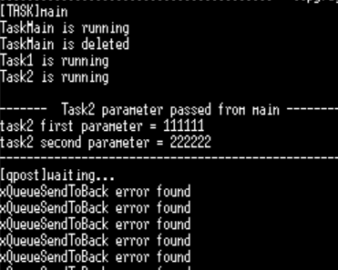
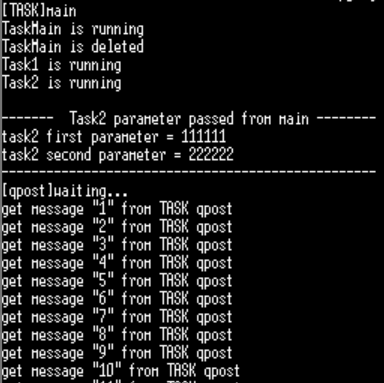
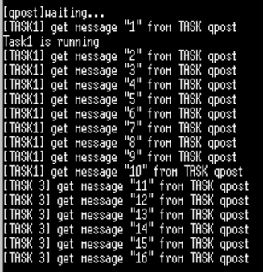
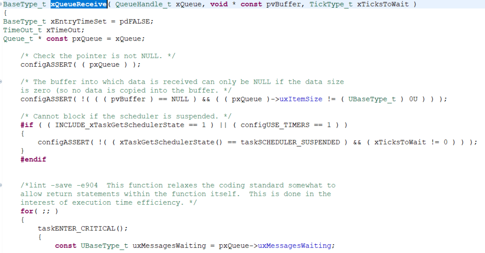

# TODO #1

```c
	/* TODO #1:
		create a Queue
	    use qid */
#if 1
qid = xQueueCreate( QUEUE_LENGTH, QUEUE_ITEM_SIZE );
if (qid == NULL) printf("xQueueCreate error found\n");
#endif // TODO #1
```

- 실행 결과
<br>

- **결과 분석:** Task 2 내에서 데이터가 잘 전송되었는지를 알기 위한 변수 `p`가 정의되어 있지 않아서  `if (p != pdPASS) printf("xQueueSendToBack error found\n");`  에 의해 오류 메시지가 출력되었다.

# TODO #2

```c
	/* TODO #2:
		post a message to TASK qpend
	    use msg[] */
#if 0
p=xQueueSendToBack( qid, &xMessage, portMAX_DELAY);
#endif // TODO #2
```
- 오류 해결을 위해 `xQueueSendToBack()`함수를 이용하였다. 2번째 인자는 포인터 값을 넘겨주어야 함에 유의하자.

- 실행 결과
<br>

```c
for(i=1; i< 10000; i++) {
		xMessage.ucData[0] = i; xMessage.ucData[1]= NULL;
```
버퍼 `xMessage`에 i값을 1부터 9999까지 집어넣고 그 값을 보낸 후 `xQueueReceive()`에서 받아 출력한다.


# TODO #3


```c
void Task3( void *pvParameters );
...
#define TASK_1_PRIO 10
#define TASK_3_PRIO 8
TaskHandle_t xHandleMain, xHandle1, xHandle2, xHandle3;
...
xTaskCreate(	(TaskFunction_t)Task3,		
						"Task3",	
						256,		
						NULL,		
						TASK_3_PRIO,	
						&xHandle3 );		
...
void Task1( void *pvParameters )
{
	const char *pcTaskName = "Task1";
	qBuffer xMessage;
	BaseType_t p;

	/* Print out the name of this task. */
	printf( "%s is running\n", pcTaskName );

	for(int i=0;i<10;i++) {
		// 메시지 큐 대기
		p =xQueueReceive( qid, &xMessage, portMAX_DELAY ) ;/* Wake up By Queue Broadcast */
		if (p != pdPASS) printf("xQueueReceive error found\n");
		printf("[TASK1] get message \"%d\" from TASK qpost\n",xMessage.ucData[0]);
	}
	vTaskDelete(NULL);
}
...
void Task3( void *pvParameters )
{
	const char *pcTaskName = "Task1";
	qBuffer xMessage;
	BaseType_t p;

	/* Print out the name of this task. */
	printf( "%s is running\n", pcTaskName );

	for(;;) {
		// 메시지 큐 대기
		p =xQueueReceive( qid, &xMessage, portMAX_DELAY ) ;/* Wake up By Queue Broadcast */
		if (p != pdPASS) printf("xQueueReceive error found\n");
		printf("[TASK 3] get message \"%d\" from TASK qpost\n",xMessage.ucData[0]);
	}
}
```
- 우선순위가 다른 TASK1(10), TASK3(8)가 서로 동일한 행동을 할 때, 우선순위에 따라 메시지 큐가 동작하는지 확인해보자.
- 정확한 확인을 위해 TASK1과 TASK3의 출력 텍스트를 구별할 수 있게 변경하였고 TASK1은 동작을 10번만 반복하도록 하였다. 
- TASK1은 10번 반복하고 동작이 끝나기 때문에 오류가 발생하지 않도록 `vTaskDelet(NULL);`을 통해 태스크를 제거하였다.

- 실행결과
<br>

쉽게 예상할 수 있듯이 TASK1이 우선순위가 높기 때문에 메시지 큐를 받았다.
따라서, 메시지 큐는 기본적으로 커널에 의해 상호배제되어있기 때문에 별다른 보호장치를 사용하지 않아도 된다.
- `xQueueReceive()` 내부에 `taskENTER_CRITICAL()`로 임계구역이 형성되어 있는 것을 알 수 있다.
<br>


