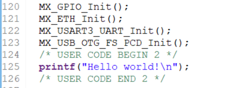
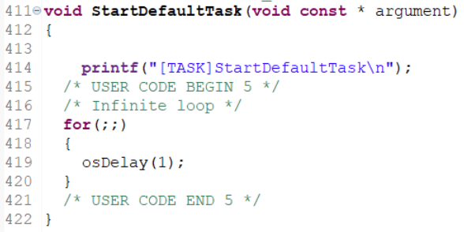

## osKernelStart
>스케쥴러 동작 함수

```c
osStatus osKernelStart (void)
{
  vTaskStartScheduler();
  
  return osOK;
}
```

## printf
<br>
<br>
<br>두 위치에 printf를 삽입하여 디버거 모드를 실행하였지만 터미널에는 printf 결과가 보이지 않음 -> 출력하기위해서는 추가적인 코드가 필요하다.

- 출력하기위해 시리얼로 redirection 해주는 코드
```c
int __io_putchar(int ch)
{
 if ( ch == '\n' )
	 HAL_UART_Transmit(&huart3, (uint8_t*)&"\r", 1, HAL_MAX_DELAY);
 HAL_UART_Transmit(&huart3, (uint8_t*)&ch, 1, HAL_MAX_DELAY);
 return ch;
}
// begin / end 사이에 추가하기. 이외에 위치에 놓으면 자동으로 삭제됨
```
- weak 함수: 이 함수를 override한다면 override된 함수로 대체된다. 
- `__io_putchar`를 weak 속성으로 사용하는 이유
	printf를 만들 때 사용자가 문자를 UART로 나가게 할지, LCD로 나가게 할지 알 수 없다. 따라서 위 코드 같이 `UART3`로 출력할 것이라고 직접 지정하면, printf는 이 코드를 타고 지정된 위치로 데이터를 내보낸다.

- 출력 확인
	

## LED 점등 예제

```c
void StartDefaultTask(void const * argument)
{
	printf("[TASK]StartDefaultTask\n");
  /* USER CODE BEGIN 5 */
  /* Infinite loop */
  for(;;)
  {
	  HAL_GPIO_WritePin(LD2_GPIO_Port, LD2_Pin, GPIO_PIN_SET);
    osDelay(500);
    HAL_GPIO_WritePin(LD2_GPIO_Port, LD2_Pin, GPIO_PIN_RESET);
    osDelay(500);
  }
  /* USER CODE END 5 */
}
```
