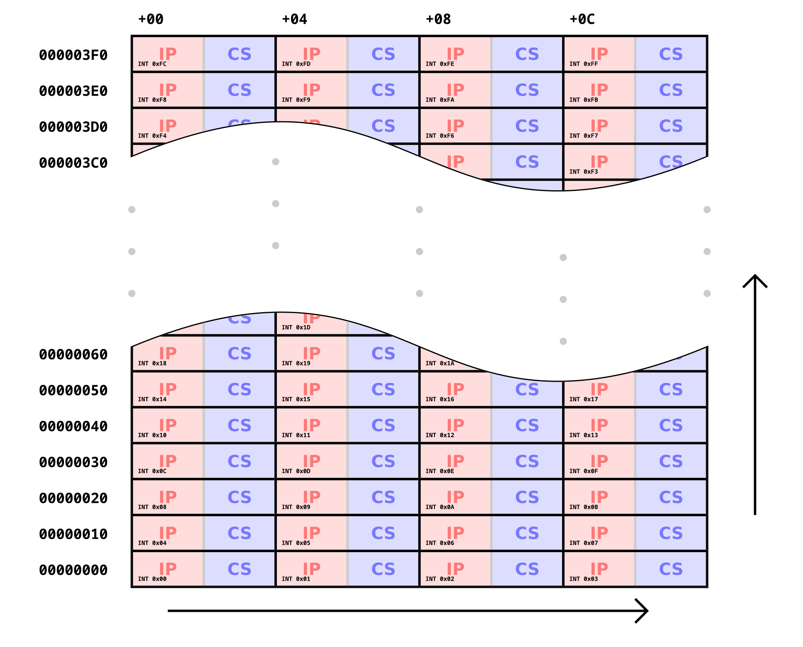

인터럽트 벡터 테이블은 CPU가 특정 상황(리셋, 오류, 하드웨어 신호 등)을 맞닥뜨렸을 때 어떤 함수로 점프해서 일을 처리해야 할지를 적어놓은 주소록(Map)이다.

<br>

## 시스템 예외 구역

```c
Reset_Handler: 전원 켜지면 제일 먼저 실행되는 곳. (부팅의 시작점)

HardFault_Handler: 프로그램이 뻗었을 때 가는 곳. (디버깅의 핵심)

SVC_Handler: OS의 시스템 콜을 호출할 때 사용.

PendSV_Handler: FreeRTOS 태스크 전환(이 일어나는 아주 중요한 곳.

SysTick_Handler: OS의 심장박동. 시간을 재고 스케줄러를 깨우는 곳.
```
