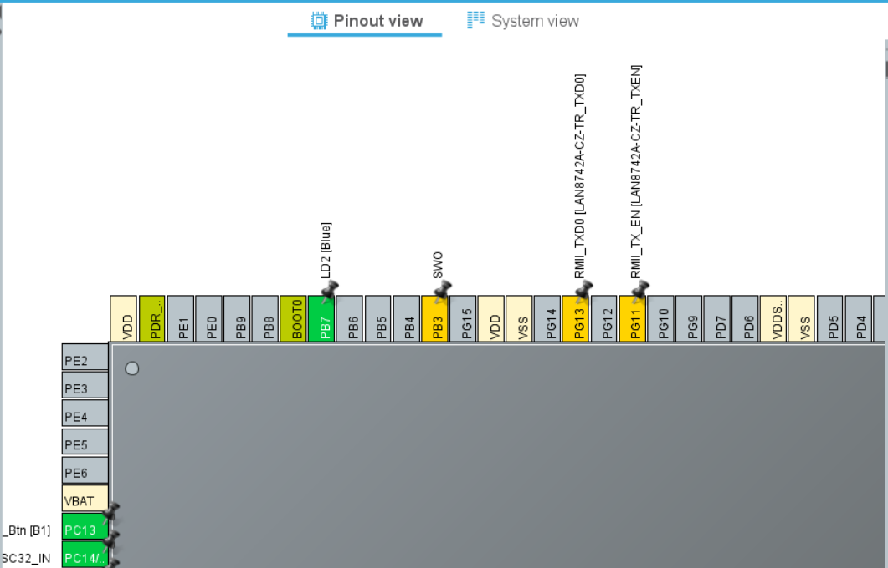
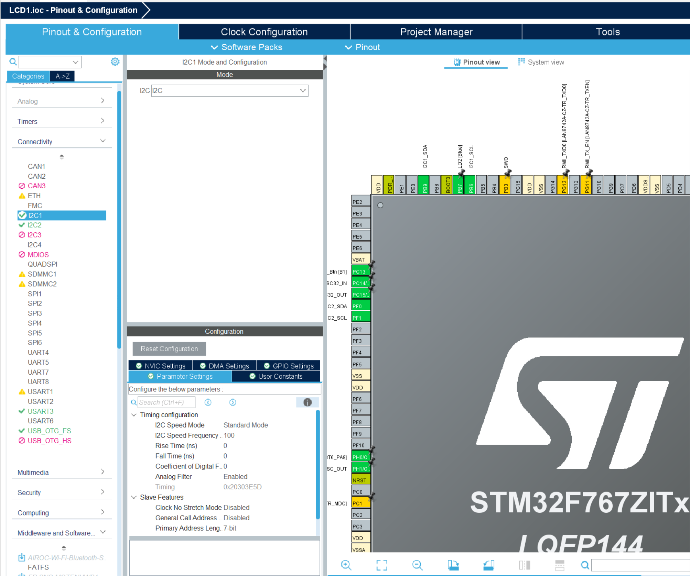
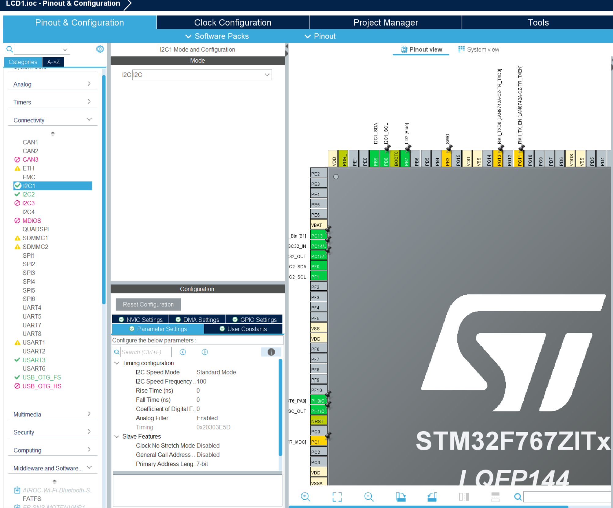

# 1. 하드웨어 연결

| **LCD 핀** | **STM32F767ZI 핀 (예시)** | **설명**                  |
| --------- | ---------------------- | ----------------------- |
| **GND**   | **GND**                | 접지 연결                   |
| **VCC**   | **5V**                 | LCD 구동 전원 (보통 5V에서 선명함) |
| **SDA**   | **PB9 (I2C1_SDA)**     | 데이터 라인                  |
| **SCL**   | **PB8 (I2C1_SCL)**     | 클럭 라인                   |

**주의사항**: STM32의 GPIO는 보통 3.3V 기반이지만, I2C 라인은 오픈 드레인(Open-drain) 방식이라 5V LCD와 연결 시 전압 레벨에 주의해야 한다. 다행히 STM32F767ZI의 많은 핀은 **5V Tolerant**이므로 직접 연결이 가능하나, 데이터 시트를 통해 해당 핀(PB8, PB9 등)이 5V를 견딜 수 있는지 확인하는 습관이 중요하다.

## 2. STM32CubeIDE 설정 (소프트웨어 초기화)

하드웨어를 연결했다면, 이제 MCU가 이 핀들을 I2C 용도로 쓰겠다고 설정해야 한다.

1. **Connectivity** 카테고리에서 **I2C1**을 선택한다.
    
2. **Mode**를 **I2C**로 설정한다.
    
3. **Configuration** 탭에서 **I2C Speed Mode**를 **Standard Mode(100kHz)**로 설정한다. (LCD는 저속 통신으로도 충분하다.)
    
4. `Ctrl+S`를 눌러 코드를 생성한다.

- 원래 핀 설정값

- I2C1 활성화 시 핀 설정값

- PB8(I2C1_SCL)로 변경

# LDC 화면 출력하기

## 1. HD44780란?

**결론: HD44780은 전 세계에서 가장 많이 쓰이는 'Character LCD 제어 칩'의 표준 규격이다.**

- **표준 컨트롤러**: 우리가 흔히 보는 16x2 LCD 뒷면에는 이 칩(또는 호환 칩)이 붙어 있다. LCD에 글자를 띄우기 위해 명령을 내릴 때, 이 칩이 정해놓은 약속(Command Set)을 따라야 한다.
    
- **통역사 역할**: MCU(STM32)가 "A"라는 글자의 아스키 코드를 보내면, HD44780이 이를 인식해서 LCD 패널의 해당 위치에 "A" 모양의 점을 찍어주는 역할을 합니다.
    
- **4비트/8비트 통신**: 원래는 8개의 데이터 선이 필요하지만, 선을 아끼기 위해 4비트씩 두 번 나누어 보내는 방식을 많이 사용한다. 내가 사용하는 I2C 배낭(Backpack) 모듈도 내부적으로는 이 4비트 방식을 사용하여 HD44780과 대화한다.

****
## I2C LCD 드라이버 및 정밀 Delay 오류 분석 
## 1. 개요 (Summary)

STM32F767ZI와 I2C LCD(HD44780)를 연결하는 과정에서 발생한 **빌드 오류**와 **런타임 프리징(Runtime Freezing)** 문제를 분석하고, 하드웨어 타이머(DWT) 대신 소프트웨어 루프를 사용하여 시스템을 정상화함.

---

## 2. 발생했던 문제 (Problem Analysis)

### 2.1 빌드 단계 오류 (Compile/Link Error)

1. **Implicit Declaration (암시적 선언)**:
    
    - **증상**: `main.c`에서 `HD44780_Init` 함수를 호출할 때 경고 또는 에러 발생.
        
    - **원인**: `main.c` 상단에 해당 함수의 원형이 선언된 헤더 파일(`#include "liquidcrystal_i2c.h"`)을 포함하지 않음.
        
2. **Undefined Reference (정의되지 않은 참조)**:
    
    - **증상**: 컴파일은 되는데 링킹 단계에서 에러 발생.
        
    - **원인**: 함수의 이름(헤더)은 알지만 실제 알맹이(코드)가 담긴 `.c` 소스 파일이 프로젝트 빌드 경로에 포함되지 않음.
        

### 2.2 실행 단계 오류 (Runtime Hang)

- **증상**: 터미널에 `Start LCD Init...`은 찍히지만 `Complete`가 찍히지 않고 프로그램이 멈춤.
    
- **원인**: `DelayUS` 함수가 사용하는 **DWT(Data Watchpoint and Trace)** 카운터가 활성화되지 않아 `while` 루프를 탈출하지 못함 (무한 루프).
    

---

## 3. 기술적 상세 분석 (Root Cause)

### 3.1 DWT(하드웨어 카운터)의 함정

기존 코드에서는 마이크로초(us) 단위의 정밀한 대기를 위해 아래 코드를 사용함:

```c
static void DelayUS(uint32_t us) {
  uint32_t start = DWT->CYCCNT; // 현재 시간 기록
  while((DWT->CYCCNT - start) < cycles); // 목표 시간까지 대기
}
```

- **문제점**: STM32F7 시리즈는 보안이나 설정 순서에 따라 `DWT->CYCCNT` 값이 0에서 멈춰 있을 수 있음.
    
- **결과**: `(0 - 0) < cycles` 조건이 항상 참이 되어 MCU가 이 라인에서 영원히 대기하게 됨.
    

### 3.2 I2C 주소 체계 (7-bit vs 8-bit)

- **분석**: I2C Scanner가 찾은 주소는 `0x27`(7비트)이지만, STM32 HAL 함수는 이를 왼쪽으로 1비트 민 `0x4E`(8비트)로 인식함.
    
- **해결**: `#define DEVICE_ADDR (0x27 << 1)`로 정의하여 통신 프로토콜을 맞춤.
    

---

## 4. 해결 방법 (Solution / Fix)

### 4.1 소프트웨어 지연(Software Loop) 방식으로 전환

하드웨어 카운터 의존성을 제거하기 위해 CPU 연산 횟수를 이용한 지연 방식으로 수정함.

```c
/* 수정된 정밀 지연 함수 */
static void DelayUS(uint32_t us) {
    // 96MHz 클럭 기준, 약 1us당 10~12번의 루프 연산 필요 (근사치)
    volatile uint32_t count = us * 10; 
    while(count--); // 단순 감소 루프를 통해 시간 소요
}
```

### 4.2 프로젝트 구성 및 초기화 보완

1. **헤더 포함**: `main.c`에 `#include "liquidcrystal_i2c.h"` 추가.
    
2. **안정화 시간 확보**: `HD44780_Init` 호출 전 `osDelay(500)`을 주어 LCD 전원 안정화 대기.
    
3. **명암 조절**: 하드웨어 뒷면 가변 저항을 조절하여 출력 확인.
    

---

## 5. 학습 포인트 및 향후 대책 (Best Practices)

1. **로그(Log)의 중요성**: `printf`를 단계별로 찍어보지 않았다면 어느 함수에서 멈췄는지 찾기 매우 어려웠을 것임.
    
2. **Safety Break**: 무한 루프(`while`)를 사용할 때는 반드시 탈출 조건(Timeout)을 고려해야 함.
    
3. **BSP의 핵심**: 제조사가 제공하는 라이브러리도 내 보드 환경(Clock, DWT 활성 여부 등)과 맞지 않을 수 있음을 항상 의심해야 함.