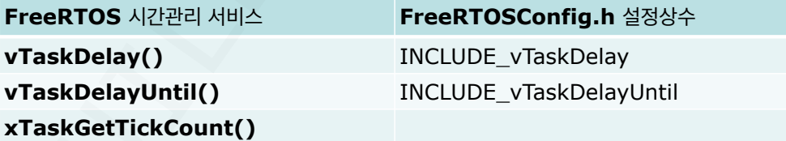

## Task 생성 함수([xTaskCreate()](../FreeRTOS_reference_Manual/xTaskCreate().md))
- 태스크를 생성한다.

## Task 일시 중단 함수([vTaskSuspend()](../FreeRTOS_reference_Manual/vTaskSuspend().md))
- Task의 실행을 일시 중단
- 태스크를 다시 동작시키이 위해서는 `vTaskResume()`을 이용한다.

## Task 재개 함수([vTaskResume()](../FreeRTOS_reference_Manual/vTaskResume().md))
- 중단된 태스크를 준비 상태로 재개
- 일시 중단된 태스크는 `vTaskResume()`에 의해서만 준비 상태로 돌아 올 수 있다.

## Task 삭제 함수([vTaskDelete()](../FreeRTOS_reference_Manual/vTaskDelete().md))
- 삭제된 태스크는 더이상 스케줄링 되지 않는다
- IDLE 태스크는 삭제 할 수 없다.
- xTaskToDelete에 NULL을 전달하면 자기 자신을 삭제하는 것도 가능하다.

## Task 우선 순위 변경 함수([vTaskPrioritySet()](../FreeRTOS_reference_Manual/vTaskPrioritySet().md))
잘 사용하지 않고 우선 순위 변경하지 않아도 원하는 방향으로 구현 할 방법이 많다
- vTaskPrioritySet()을 이용하여 변경한다.
- 자기 자신(NULL) 혹은 다른 태스크의 우선 순위를 변경한다.
- IDLE 태스크의 우선 순위 변경은 불가하다.

## Task 정보 받아오는 함수([vTaskGetTaskInfo()](../FreeRTOS_reference_Manual/vTaskGetTaskInfo().md))
- 지정한 태스크의 주요 정보를 얻어온다
- 디버깅시 활용 가능하다 -> 첫 번째 인자에 정보를 가져오길 원하는 태스크의 인자를 입력하고 조사한 모든 정보를, 두 번째 인자의 구조체 주소에 해당하는 구조체에 모든 정보를 넣는다. 
```c
void vAFunction( void ) 
{ 
	TaskHandle_t xHandle; // 정보를 조회하고자 하는 대상 태스크의 핸들이다.
	TaskStatus_t xTaskDetails; // 함수 실행 결과로 전달받을 태스크의 이름, 상태, 우선순위, 스택 사용량 등의 데이터를 저장하는 구조체 변수이다.
	 
	vTaskGetTaskInfo( 
	xHandle, 
	&xTaskDetails,
	pdTRUE, /* 스택 고수위치(High Water Mark) 정보를 포함할지 여부를 결정한다. `pdTRUE`로 설정하면 태스크 생성 이후 스택이 가장 많이 사용되었을 때의 남은 여유 공간 크기를 계산하여 반환한다. */  
	eInvalid /* 태스크의 현재 실행 상태를 조회하도록 요청하는 설정이다. `eInvalid`를 전달하면 커널이 해당 태스크의 실제 상태를 파악하여 구조체에 기록한다. */ ); 
}
```

## 시간 관리 서비스

### [vTaskDelay()](../FreeRTOS_reference_Manual/vTaskDelay().md)
- 함수 원형: `vTaskDelay(const TickType_t xTicksToDelay)`
	`xTicksToDelay`: 시간 지연 틱
- TICK 인터럽트는 1ms의 주기(단, 타이머의 설정에 따라 달라짐) -> 1 TICK 주기는 `configTICK_RATE_HZ` 설정에 따라 다르다
- 문맥 전환 발생: 실행 중인 태스크가 block 큐로 옮겨지기 때문이다.
- 밀리초를 틱으로 변환해 주는 매크로 `pdMS_TO_TICKS()`
	사용 예:
```c
#define TIME_100ms (INT16U)((INT32U)configTICK_RATE_HZ * 100L / 1000L) 
void MyTask (void *pdata) 
{ 
	for (;;) { 
	    vTaskDelay(OS_TIME_100ms); // 100ms 지연          
        vTaskDelay(pdMS_TO_TICKS(100)); // 100ms 지연         
        /* User code */ 
    }
}
```

- `OS_TIME_100ms`: `vTaskDelay`함수는 인자로 밀리초가 아닌 Tick count를 받는다. 따라서 이 방식은 사용자가 직접 1초당 틱 횟수를 이용해 100ms에 해당하는 틱을 계산 하도록 식을 만든 것이다. 
	  
- `pdMS_TO_TICKS(100)`: FreeRTOS 기본 제공 매크로 방식이며, 내부적으로   `((TickType_t)(((uint32_t)(xTimeInMs)*(uint32_t)configTICK_RATE_HZ)/(uint32_t)1000U))`와 같은 연산을 수행하여 **ms를 Tick으로 자동 변환**해준다.
	장점: 
	1. 가독성이 좋다.
	2. 이식성이 좋다: `configTICK_RATE_HZ`값에 상관없이 매크로를 이용하면 `pdMS_TO_TICKS(100)`은 항상 100ms를 보장한다.
	3. 오버플로우 방지 및 안정성: 직접 계산하지 않고 커널에서 검증된 수식을 사용하므로 훨씬 안전하다.

### [vTaskDelayUntil()](../FreeRTOS_reference_Manual/vTaskDelayUntil().md)
- 함수 원형: `vTaskDelayUntil(TickType_t *pxPreviousWakeTime, TickType_t xTimeIncrement)`
- 절대 시간에 도달 할 때까지 `vTaskDelayUntil()`을 호출하는 작업을 차단됨 상태로 만듦
- 주기적 태스크는 `vTaskDelayUntil()`을 사용하여 실행 빈도를 일정하게 유지 할 수 있다.
- `pxPreviousWakeTime`: 이 시간은 작업이 다음에 차단됨 상태를 벗어나는지 시간을 계산하기 위한 참조점으로 사용됨
- `xTimeIncrement`는 틱 단위로 지정됨. `pdMS_TO_TICKS()` 매크로는 밀리초를 틱으로 변환하는데 사용될 수 있다.
	사용 예:
```c
/* Define a task that performs an action every 50 milliseconds. */ void vCyclicTaskFunction( void * pvParameters ) 
{ 
  TickType_t xLastWakeTime; 
  const TickType_t xPeriod = pdMS_TO_TICKS( 50 ); 
  xLastWakeTime = xTaskGetTickCount(); 
  /* Enter the loop that defines the task behavior. */ 
  for ( ;; ) 
  { 
    /* xLastWakeTime is automatically updated within vTaskDelayUntil()     so is not explicitly updated by the task. */ 
    vTaskDelayUntil( &xLastWakeTime, xPeriod ); 
    /* Perform the periodic actions here. */ 
  } 
}
```

`vTaskDelay` vs `vTaskDelayUntil`
	예를 들어, 모터 제어 태스크가 10ms마다 돌도록 하였을 때, 연산을 하느라 어떤 때는 2ms, 어떤 때는 5ms를 사용한다면 `vTaskDelay(10)`을 사용하면 매번 주기가 밀리게 되지만 `vTaskDelayUntil(10)`을 사용한다면 연산 시간과 상관 없이 정확히 10ms의 주기를 지킬 수 있다.

한 줄 요약: 실행 시간의 변동과 상관없이 태스크가 고정된 주기로 실행되도록 보장하는 함수이다.

### IDLE task
- `prvIdleTask()` 함수는 우선순위 0으로 최하위 우선순위이다.
- 삭제할 수 없는 태스크이다.
- `vTaskStartScheduler()`에서 생성된다. 시스템이 켜지면 커널이 자동으로 생성한다.
- `vApplicationIdleHook()`: Idle Task가 실행될 때마다 호출하는 콜백 함수이다. 내부에 CPU 저전력 모드 명령어를 포함한다.
	-> 콜백 함수: 어떤 이벤트가 발생했을 때 시스템이 나 대신 호출해 주도록 미리 등록해둔 함수.
```c
static portTASK_FUNCTION( prvIdleTask, pvParameters ) 
{ 
	for( ;; ) 
	{ 
		#if ( configUSE_PREEMPTION == 0 ) 
		{ 
			taskYIELD(); 
		} 
		#endif /* configUSE_PREEMPTION */ 
		#if ( ( configUSE_PREEMPTION == 1 ) && ( configIDLE_SHOULD_YIELD == 1 ) ) 
		{ 
		#if ( configUSE_IDLE_HOOK == 1 ) 
		{ 
			vApplicationIdleHook(); 
		} 
	#endif /* configUSE_IDLE_HOOK */ 
	}
}
```

- `Idle Hook()` 함수 예시
```c
void vApplicationIdleHook (void)
{
	printf("."); fflush(stdout);
}
```
- `lde Hook` 사용 시 주의사항:
1. **절대 차단 금지**: 이 함수 안에서 `vTaskDelay()`나 세마포어 대기를 하면 안된다. Idle Task 자체가 멈춰버리면 시스템 전체가 마비될 수 있다.
2. **빠른 실행**: 여기서 너무 긴 연산을 하면 안된다. 다른 태스크가 실행되어야 할 때 즉시 비켜줄 수 있을 정도의 짧은 작업만 해야 한다.
3. **설정 확인:** `FreeRTOSConfig.h`에서 `#define configUSE_IDLE_HOOK 1`로 설정되어 있어야만 동작한다.