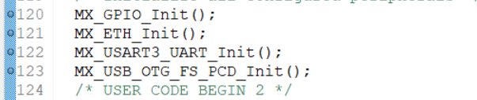
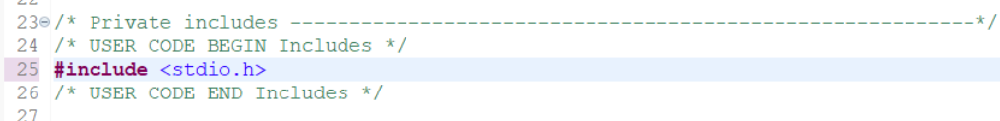
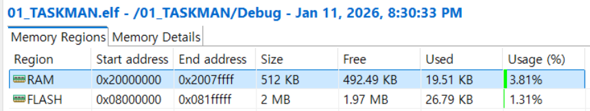
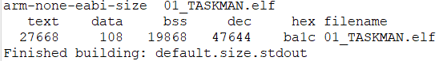
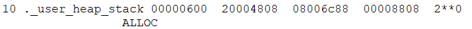

### 2026-01-04
STM32F7 package가 설치가 안되어있어서 코드 생성이 안됐었다.
<br> STM 가입하고 package 설치하였다.
<br>`.ioc` 파일은 설계도 일뿐, `.ioc` 이용해서 코드를 생성해야 한다.

### 2026-01-10

<br>toggle breakpoint : 디버깅 모드에서 사용할 break point 설정



<br>코드는 항상 begin과 end 사이에 추가

scalability mode: 이 모드가 활성화되면 다음 기능들이 제한될 수 있다.

- **코드 폴딩(Code Folding):** `+`, `-` 버튼을 눌러 함수 내용을 접었다 펴는 기능이 작동하지 않을 수 있다.
    
- **실시간 문법 에러 표시:** 코드를 치자마자 빨간 줄이 뜨는 기능이 꺼질 수 있다.
    
- **하이퍼링크 (Ctrl + Click):** 함수 이름을 눌러서 정의된 곳으로 이동하는 기능이 느려지거나 안 될 수 있다. 

### 2026-01-11

- Window/ShowView/Build analyze를 통해 메모리 사용량 확인 가능
[CMSIS,HAL](./CMSIS,HAL.md)

### 2026-01-14
[Introduction to FreeRTOS](../Theory/Introduction_to_FreeRTOS.md) 
### 2026-01-17

FreeRTOSConfig_base.h와 FreeRTOSConfig.h 사이 관계.
<br>base 파일은 모든 소스파일에 동일하고 그냥 config 파일은 base 파일을 기반으로 변경된 것만을 적어놓았기 때문에. 각 실습 별로 차이점을 알기 쉽다.

### 2026-01-18

- build하여 각 파일의 size를 알 수 있다.

- 컴파일 이후 만들어지는 list 파일을 통해 프로그램의 MAP 정보를 알 수 있다.


- user heap loaction: 0x20004808

디버깅 모드로 확인
<br>
- main stack이 어디서 부터 시작되는지 알 수 있다. 
실행버튼 누른 후
<br>
<br>
- task 스택에 대해 알 수 있다
1. MAP 파일을 통해 알 수 있는 정보
	<br>`.bss` 영역 시작: 0x2000006c
	<br>`.bss` 영역 크기: 0x0000479c
	<br>`.bss` 영역 끝: 0x20004808
2. 현재 task의 sp 값은 `0x20000e88`로 범위 내에 존재한다.
	<br>FreeRTOS에서 `vTaskCreate()`를 호출하면, 커널은 내부적으로 `pvPortMalloc()`을 사용하여 `bss`에 TCB와 Stack 공간을 할당한다.
<br>- bss내에 task가 생성됨을 알 수 있다.

#### 인터럽트 상황에서 sp -> msp로 전환되는 이유
>태스크 스택(PSP)의 불안정성으로부터 시스템 전체를 보호하고, 인터럽트가 중첩되어도 커널이 안전하게 동작할 수 있는 공간을 확보하기 위해서이다.

1. 태스크 스택의 불안정성 (Stack Overflow 방지)
	개별 태스크는 한정된 자원(Heap 영역의 일부)을 쪼개서 사용한다.

- **위험 상황:** 만약 특정 태스크에서 지역 변수를 너무 많이 잡거나 재귀 함수를 써서 자신의 스택($0x20000e88$ 부근)을 거의 다 써버렸을 때 인터럽트가 발생고 인터럽트가 여전히 그 태스크의 스택(PSP)을 사용한다면, 인터럽트 핸들러가 실행되면서 태스크의 메모리 영역을 침범하고 시스템이 즉시 다운 될 것이다.
    
- **해결:** 하드웨어(Cortex-M)가 인터럽트 시점에 자동으로 안전한 MSP($0x2007ffe0$)로 갈아타게 함으로써, task가 아무리 엉망이 되어도 시스템 관리(인터럽트)는 안정적으로 수행될 수 있게 보호하는 것이다.
    
2. 인터럽트 중첩(Nested Interrupt) 처리
	임베디드 시스템에서는 우선순위가 높은 인터럽트가 실행 중인 인터럽트를 끊고 들어올 수 있다.

- 인터럽트가 중첩될 때마다 스택이 계속 쌓이게 되는데, 이를 모든 개별 태스크 스택에 대비해서 넉넉히 잡아주는 것은 메모리 낭비이다. 대신, 모든 인터럽트가 하나의 공용 통로인 MSP를 사용하게 하면, MSP 영역만 충분히 확보해두면 어떤 task가 실행 중이든 상관없이 인터럽트 처리가 가능해진다.
    
3. 하드웨어의 자동 동작 (Exception Entry)

	이 과정은 소프트웨어가 아니라 **CPU 하드웨어**가 수행한다.

- 인터럽트 발생 시, 하드웨어가 현재 사용 중인 레지스터들($R0 \sim R3$, $R12$, $LR$, $PC$, $xPSR$)을 현재 스택(PSP)에 자동으로 저장(Push)한다.  그 직후, CPU 내부의 `CONTROL` 레지스터가 변하면서 스택 포인터가 **MSP**로 자동 전환된다. 인터럽트 핸들러(`ISR`)는 이제 $0x2007ffe0$부터 시작하는 널널한 MSP 공간을 사용한다.
    
#### MSP vs PSP
- **MSP (Main Stack Pointer):** $0x2007ffe0$
    - **역할:** 커널(OS)의 핵심 로직, 리셋 직후의 초기화 코드, 그리고 모든 **인터럽트(ISR)** 상황에서 사용된다.
    - **위치:** 링커 스크립트에 정의된 전체 RAM의 끝 지점(SRAM2 영역)에서 아래로 자라난다. 그래서 주소값이 높게 형성된다.
        
- **PSP (Process Stack Pointer):** $0x20000e88$
    - **역할:** 실제 실행 중인 **개별 Task**가 자신의 로컬 변수를 저장하거나 함수를 호출할 때 사용한다.
    - **위치:** FreeRTOS 힙 영역(보통 `.bss` 섹션 내의 `ucHeap` 배열)에서 할당받는다. 앞서 MAP 파일에서 확인한 $0x2000....$ 영역에 위치하는 이유이다.

<br>[Task_and_Stack_memory](../Theory/Task_and_Stack_memory.md): 메모리 단편화 추가
<br>[02_STACKOVERFLOW](../Labs/02_STACKOVERFLOW.md): 실습 내용 정리

### 2026-01-26
[TASK_함수_모음](./TASK_functions.md) 작성
	<br>- vTaskDelet()
	<br>- vTaskPrioritySet()
	<br>- vTaskGetTaskInfo()
	<br>- vTaskDelay()
	<br>- vTaskDelayUntil()
<br>[Task and Stack memory](../Theory/Task_and_Stack_memory.md): TCB, stack 메모리 크기 최적화, 런타임 스택 검사 방법 2가지 내용 추가
<br>[Naming_rules](./Naming_rules.md)
<br>[FreeRTOSConfig_base.h](./FreeRTOSConfig_base.h.md) : `INCLUDE_` 상수 관련 내용 작성
<br>[NVIC](../Theory/NVIC.md) : NVIC 및 SysTick 내용 작성
<br>[임계 영역(Critical Section)](../Theory/CRITICAL_SECTION.md)
<br>함수 매뉴얼 작성:[taskENTER_CRITICAL()](../FreeRTOS_reference_Manual/taskENTER_CRITICAL().md), [taskEXIT_CRITICAL()](../FreeRTOS_reference_Manual/taskEXIT_CRITICAL().md)

### 2026-01-30
[Task and Stack memory](../Theory/Task_and_Stack_memory.md): TCB 내용 추가
<br>[Context Switching](../Theory/Context_Switching.md)
<br>[Clock Tick](./Clock_Tick.md)
- FreeRTOS의 버전 확인 방법 (task.h)
```c
#define tskKERNEL_VERSION_NUMBER "V10.2.0"
#define tskKERNEL_VERSION_MAJOR 10
#define tskKERNEL_VERSION_MINOR 2
#define tskKERNEL_VERSION_BUILD 0
```
- 문맥저장 & 문맥복원 간단 정리(A->B->A)
1. 문맥 저장: 현재 실행중인 태스크 A에서 B로 전환될 때 발생하며 현재 CPU가 작업하던 레지스터의 모든 정보를 현재 태스크의 스택에 차례대로 저장한 후 가장 상단인 SP 위치를 해당 태스크의 제어 블록에 저장한다.
2. 문맥 복원: CPU의 SP 레지스터를 태스크 B가 이전에 저장해두었떤 SP주소로 점프시킨다. 해당 SP 위치부터 스택에 쌓여있던 정보를 pop하여 CPU의 실제 레지스터로 하나씩 꺼내온다. 마지막으로 PC 값이 복원되면, 태스크 B는 이전에 멈췄던 바로 그 지점부터 다시 실행을 시작한다. 

- 콜백 함수: 어떤 이벤트가 발생했을 때 시스템이 나 대신 호출해 주도록 미리 등록해둔 함수이다.
<br>즉, 액티브 함수가 아닌 패시브 함수이다.