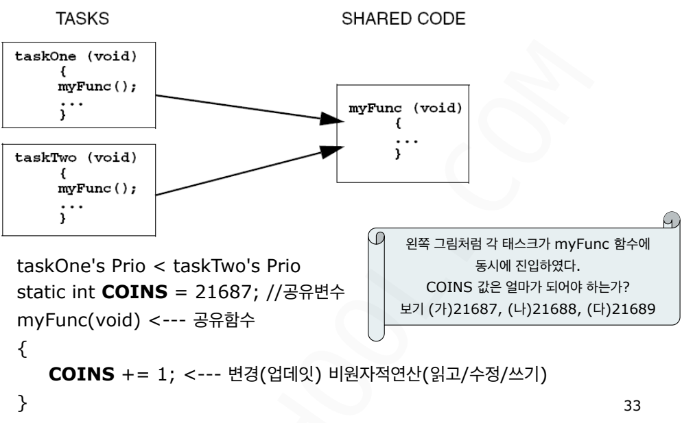
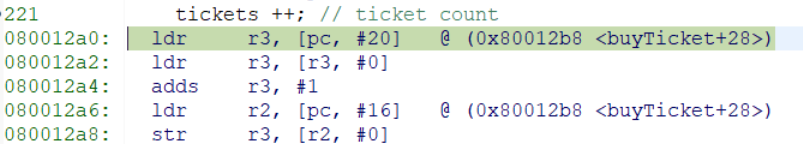
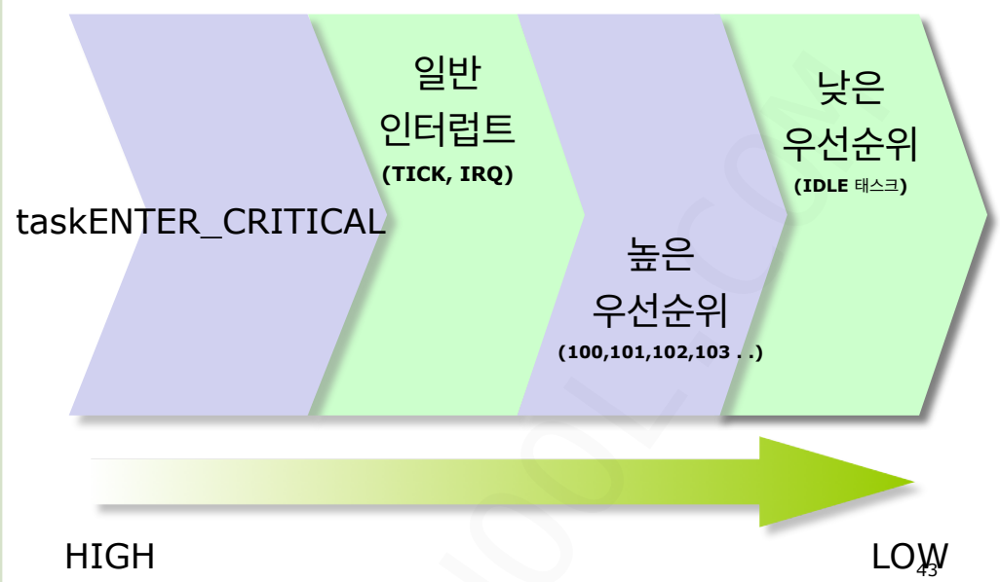
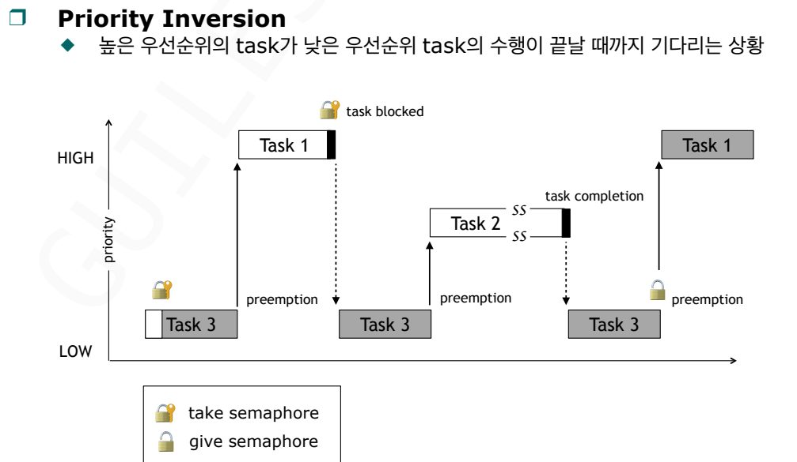
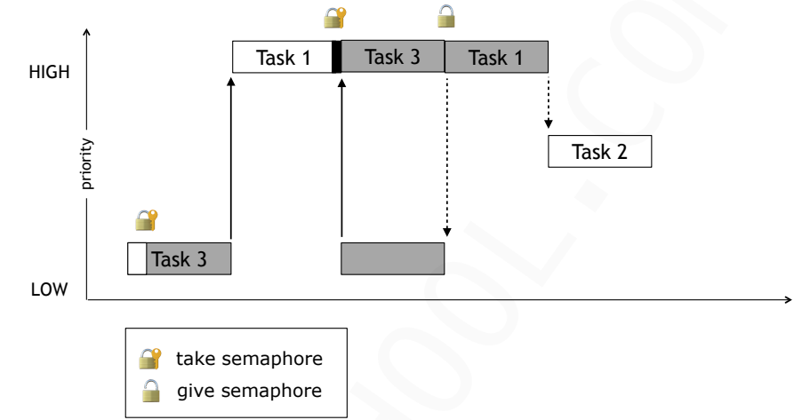
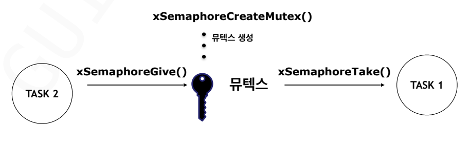

# Critical Section
>공유 자원을 사용 중인 함수내의 일부 혹은 전체 영역
- 일단 이 코드 영역의 실행이 시작되면 적어도 다른 태스크(설령 우선순위가 높은 태스크라 할지라도)가 이 영역을 선점하여 실행하는 일이 없어야 하고 그렇게 하도록 한다.
- 임계영역을 보호하기 위한 장치는 다음과 같은 것이 있다.
	<br>인터럽트 중단
	<br>스케줄링 중단
	<br>[세마포어](./Semaphore.md)(상호배제 커널 서비스)
## 동시성 문제
<br>

- 비원자적 연산 예시
<br>
<br>[03_CRITICAL](../Labs/03_CRITICAL.md) 실습 과정에서 확인한 어셈블리 동작을 통해 볼 수 있듯이 5단계에 걸쳐 메모리->레지스터->메모리로 연산이 진행된다. 
<br>이때 문맥전환은 어셈블리 한 줄마다 발생하는데 TASK1과 TASK2는 각자의 r3를 이용하여 연산하지만, TASK1이 메모리에 값을 완전히 업데이트 하기전에 TASK2가 연산을 진행하면 잘못된 값이 메모리에 올라간 상태로 계속해서 연산을 진행하게 되어 결과적으로 의도하지 않은 값을 얻게 된다.

## 재진입(Reentrancy)
- 멀티태스킹 환경 그리고 다수의 태스크에서 호출하여 사용할 수 있도록, 해당 함수는 재진입 가능하도록 작성되어 있어야 한다.
- 멀티태스킹 환경이긴 하지만 단일 태스크만이 독점하여 사용할 것으로 확신 할 수 있는 경우에는 해당 함수는 재진입이 아니어도 무방하다.

- 멀티태스킹 환경에서 함수의 재진입이 불가한 경우
```c
int Temp; /*전역변수*/ 
void swap(int *x, int *y) 
{ 
    Temp    = *x; 
    *x     = *y; 
    *y     = Temp; 
}
```
<br> Temp를 공유하고 있으므로 재진입 불가

- 함수를 재진입 가능하도록 하려면
	- 전역변수를 사용하지 않는다.
	- 세마포어 같은 커널 리소스로 전역변수를 보호한다.
	- 전역변수 사용하는 동안 인터럽트 작동을 임시로 중단한다.
```c
void swap(int *x, int *y) 
{
	int Temp; // 지역변수 사용
    Temp    = *x; 
    *x     = *y; 
    *y     = Temp; 
}
```

## 상호배제(Mutual Exclusion) 방법들
### 1. 인터럽트 금지
- 선점이 작동하기 위해서는 인터럽트 발생이 필수적이다.
- 공유자원을 사용하는 동안 인터럽트를 비활성화하면 문맥 전환, 선점 무엇도 동작하지 않는다. 즉, 멀티 태스킹이 동작하지 않게 된다.
- 임계영역코드의 실행 시간이 비교적 아주 짧은 경우에 효과적이다.
- 타임 TICK 인터럽트의 주기를 놓치지 않도록 주의해서 사용해야 한다.
- 사용 예
```c
task1( ) 
{ 
    . . . 
	인터럽트 비 활성화 (disable) 
	공유 자원 액세스 (임계영역) 
	인터럽트 활성화 (enable) 
    . . . 
}
```
### 2. 스케줄링 중단
- 공유자원을 사용하는 동안 스케줄링을 금지시킨다.
- **FreeRTOS에서는 지원하지 않는다.**
- 임계영역코드의 실행 시간이 비교적 아주 짧은 경우 효과적이다.
- 이 실행이 빈번할 경우 높은 우선 순위 태스크 실행이 늦어지는 현상이 발생할 가능성이 있다.
- 사용 예
```c
task1( ) 
{ 
    . . . 
	스케줄링 중단(disable) 
	공유 자원 액세스 (임계영역) 
	스케줄링 재개 (enable) 
    . . . 
}
```
#### 3. 세마포어류(세마포어, 뮤텍스)의 커널서비스 사용
- 상호 배제로 즐겨 사용되는 방법으로 가장 추천되고 안전한 방법이다
- 사용이 지나치게 많을 경우 태스크의 blocking이 잦아지며 이로 인한 오버헤드 증가
- 사용 예
```c
task1( ) 
{ 
    . . . 
	세마포어 LOCK 
	공유 자원 액세스 (임계영역) 
	세마포어 UN-LOCK 
    . . . 
}
```
### 4. 하나의 task가 독점하는 방법
- 가장 이상적인 방법이다.
- 공유 자원을 퇴도록 사용하지 않는다.
- 공유 자원(변수, I/O 장치)을 사용하더라도 이 자원을 다수의 태스크가 공유 하도록 하지 않는다.
- 사용 예
```c
task1( ) 
{ 
    . . . 
	//세마포어 LOCK 
	공유 자원 액세스 (task1이 독점) 
	//세마포어 UN-LOCK 
    . . . 
}
```

### Critical Section
- [taskENTER_CRITICAL()](../FreeRTOS_reference_Manual/taskENTER_CRITICAL().md),[taskEXIT_CRITICAL()](../FreeRTOS_reference_Manual/taskEXIT_CRITICAL().md): FreeRTOS에서의 critical section 보호
- 인터럽트 비활성화 시간은 실시간 운영체제의 중요한 성능지표이다.
	리얼 타임 이벤트의 응답 시간을 결정한다
- 응용 프로그램에서도 사용할 수 있다.
	단, 인터럽트 비활성화 상태에서 사용하면 시스템이 멈출수도 있다.
	임계구역 내에서 커널 함수 사용하지 않는 것이 좋다.
	ex) `vTaskDelay()`
- **FreeRTOS 서비스를 호출할 때 인터럽트는 꼭 활성화 상태여야 한다.** 
- 사용 예
```c
{ 
    taskENTER_CRITICAL(); // 인터럽트 비활성화
    /* Critical Section*/ 
    taskEXIT_CRITICAL(); // 인터럽트 활성화
}
```
- FreeRTOS의 절대 우선 순위
<br>
<br>`taskENTER_CRITICAL()`에서의 우선순위는 어디까지 인터럽트를 비활성화 할 것인가를 결정하는 경계선이다.

우선순위는 태스크 우선순위(숫자 클수록 우선순위 높음)와 인터럽트 우선순위(숫자 작을수록 우선순위 높음)가 존재한다.

----------


## 우선순위 역전(Priority Inversion)



- **Task 1 (1순위)**: 지금 당장 일을 해야 하는데, **Task 3**이 가진 열쇠(세마포어)가 필요해서 기다리는중이다(Blocked) .
    
- **Task 3 (3순위)**: 작업을 수행하려고 하는데, 갑자기 **Task 2**가 나타난다.
    
- **Task 2(2순위)**: Task 3보다 우선순위가 높기 때문에 Task 3을 밀어내고 CPU를 차지한다.
    
- **결과**: **Task 1**은 정작 아무 상관도 없는 **Task 2**가 일을 다 끝낼 때까지 하염없이 기다리게 된다.

## 우선순위 상속(Priority Inheritance)
> 저우선순위 태스크가 가진 자원을 고우선순위 태스크가 기다리게 될 때, 자원을 가진 저우선순위 태스크의 등급을 고우선순위만큼 일시적으로 올려주는 것이다.



- **상속 발생**: Task 1이 Task 3이 가진 **뮤텍스**를 기다리기 시작하는 순간, **Task 3의 우선순위가 Task 1급으로 상승**한다.
    
- **Task 2 차단**: 이때 Task 2가 실행되려고 나타나지만, 현재 실행 중인 Task 3의 우선순위가 더 높기 때문에 **Task 2는 끼어들지 못한다.**
    
- **자원 반납**: Task 3은 방해받지 않고 빠르게 일을 끝낸 뒤 세마포어를 반납한다.
    
- **우선순위 복구**: 자원을 돌려준 **Task 3은 다시 원래의 낮은 순위**로 돌아간다.
    
- **Task 1 즉시 실행**: 기다리던 Task 1이 즉시 자원을 낚아채서 실행한다.
	
- Task 2가 Task 1 대신 실행되지 않는다.

### **1. 기본 우선순위 상속 (PIP, Priority Inheritance Protocol)**

가장 일반적이고 직관적인 방식이다.

- **동작 원리**: 
    - 고우선순위 태스크(A)가 저우선순위 태스크(C)가 가진 자원을 기다리게 되는 **그 순간**, 태스크 C의 우선순위를 태스크 A만큼 끌어올린다.
        
- **장점**:
    - 필요할 때만 우선순위가 바뀌므로 시스템 리소스를 효율적으로 쓴다.
	      
    - 구현이 상대적으로 간단하다.
        
- **단점**:
    - **데드락(Deadlock)** 문제를 완전히 예방하지는 못한다. 여러 자원이 얽혀 있을 때 순환 대기 현상이 발생할 수 있다.

### **2. 우선순위 상한 (PCP, Priority Ceiling Protocol)**

조금 더 강력하고 예방적인 방식이다.

- **동작 원리**: 
    - 각 자원(뮤텍스 등)에 **상한 우선순위**를 미리 정해둔다. **(그 자원을 사용하는 태스크 중 가장 높은 우선순위로 설정)**
        
    - 어떤 태스크든 이 자원을 획득하는 순간, 실제로 기다리는 높은 태스크가 없더라도 즉시 우선순위를 상한선까지 올려버린다.
        
- **장점**:
    - **데드락을 원천적으로 방지**할 수 있다.
        
    - 우선순위 역전이 발생하는 시간을 더 엄격하게 제한(Bounding)할 수 있어 실시간성 보장에 유리하다.
        
- **단점**:
    - 기다리는 높은 태스크가 없는데도 우선순위가 올라가므로, 다른 중간 순위 태스크들이 불필요하게 밀려날 수 있다.

### **3. 우선순위 상속에서 뮤텍스를 사용해야하는 이유**

#### 1. 소유권(Ownership)의 유무

- **뮤텍스**: 이름표가 붙은 열쇠이다. 누가 열쇠를 가졌는지 OS가 기록한다. 주인을 알기 때문에 그 주인이 저순위라면 고순위만큼 등급을 올려줄 수 있다.
    
- **세마포어**: 누구나 쓸 수 있는 동전이다. 누군가 동전을 가져갔다는 건 알지만, 그게 누구인지 OS는 관심이 없다. 주인을 모르니 우선순위를 올려주고 싶어도 누구를 올려줄지 알 수 없다.
    

#### 2. 우선순위 상속(Priority Inheritance) 지원

- **뮤텍스**: 우선순위 역전 현상을 막기 위해 **우선순위 상속 프로토콜**이 내장되어 있다. 고순위 태스크가 기다리면 자원 점유자의 순위를 자동으로 끌어올린다.
    
- **세마포어**: 애초에 상속 기능이 설계되어 있지 않다. 따라서 세마포어로 자원을 보호하다가 중간 순위 태스크가 나타나면 시스템이 꼼짝없이 밀리게 된다.
    

## MUTEX
> mutual exclusion semaphore의 약자이다.

- 태스크가 자원에 대한 독점적인 액세스를 얻고자 할때 용도로 사용한다.
- 일종의 바이너리 세마포어이다.
- 우선순위역전 문제를 해결할 수 있다.


