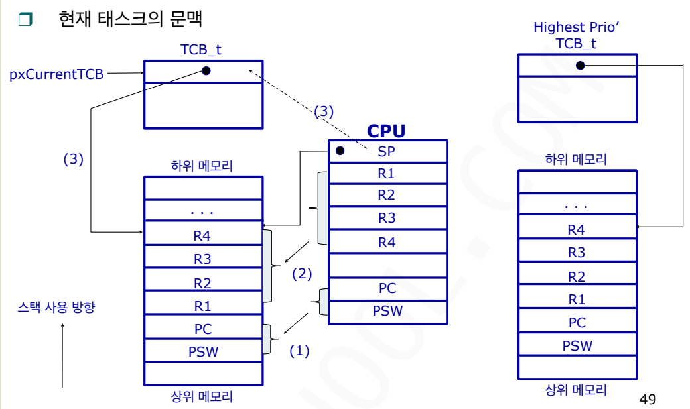
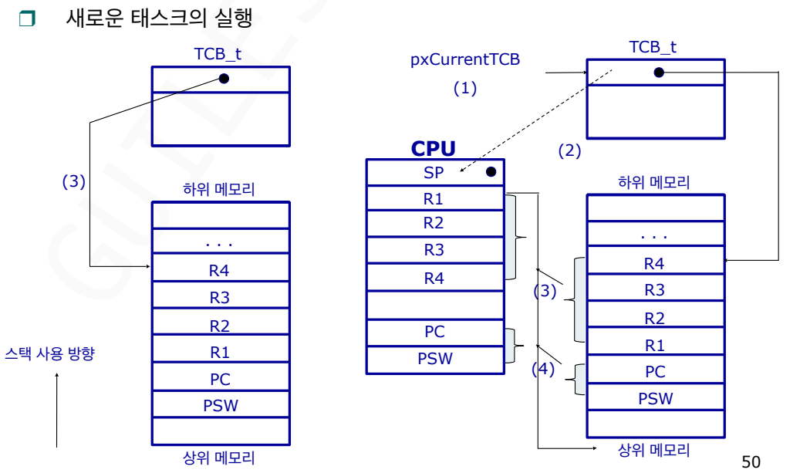
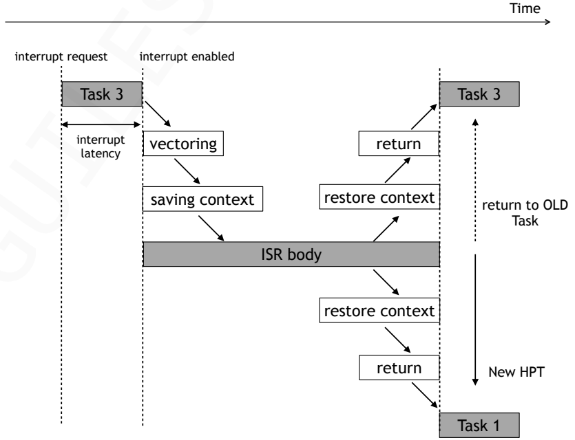

## 문맥
>CPU가 특성 task를 중단했다가 다시 이어서 실행하기 위해 필요한 최소한의 상태 정보이며 현재 CPU 내부에 있는 모든 레지스터의 값이다.  

### 구성 요소
- **PC (Program Counter)** : 디음에 실행할 명령어 주소.
- **SP (Stack Pointer)**: 현재 태스크의 스택 위치. 
- **LR (Link Register)**: 함수 호출 후 돌아갈 주소. 
- **R0 ~ R12**: 연산 도중에 생성된 중간 데이터들.

### 문맥 전환
>현재 실행 중인(선점) 태스크의 레지스터 값을 TCB(Stack)에 저장하고, 새로운 태스크의 TCB로부터 레지스터 값을 CPU로 로드하는 과정. 
- **주의사항**: 문맥 전환이 잦으면 오버헤드가 발생하여 시스템 성능이 저하될 수 있다.

`vPortYieldProcessor()`를 이용하여 문맥 전환을 수행한다.
```c
void vPortYieldProcessor( void ) 
{ 
    /* 1. 복귀 주소 보정: 
현재 실행 중인 명령어 다음으로 돌아가기 위해 Link Register(LR) 값을 4 증가시킴 */
    __asm volatile ( "ADD LR, LR, #4" ); 

    /* 2. 문맥 전환 수행: 
	가장 먼저, 현재 실행 중인 태스크의 모든 레지스터(문맥)를 스택에 저장함  */
    portSAVE_CONTEXT(); 

    /* 3. 스케줄링 실행: 
레디 상태에 있는 태스크 중 가장 우선순위가 높은 태스크를 찾아서 pxCurrentTCB를 변경함 */
    __asm volatile ( "bl vTaskSwitchContext" ); 

    /* 4. 새로운 문맥 복원: 
방금 선택된 새로운 태스크의 저장되어 있던 레지스터 값들을 CPU로 다시 불러옴 */
    portRESTORE_CONTEXT();  
}
```

#### 문맥 저장
- 현재 태스크의 문맥

- 현재 태스크가 잠시 쉬러 가기 전에, 지금까지 어디까지 했는지를 기록하는 과정이다. 
1. CPU안의 레지스터에 담긴 Old task의 정보를 이 task의 stack 영역으로 복사한다.
2. 레지스터들은 스택에 차곡차곡 쌓인다.
3. 마지막으로, 이 모든 것이 저장된 위치(가장 위의 주소)인 스택 포인터 값을 해당 태스크의 TCB의 첫 번째 칸에 저장한다.
#### 문맥 복원
- 새로운 태스크의 실행

- 새로운 태스크가 다시 일을 시작하기 위해 저장된 기록을 다시 불러오는 과정이다.
1. 새로운 태스크의 TCB에 저장되어 있던 SP 값을 확인하여 해당 태스크의 스택 위치를 찾아간다.
2. 스택에 쌓여 있던 옛날 기록(레지스터 값들)을 다시 화살표를 따라 CPU의 실제 레지스터로 하나씩 옮겨 담는다.
3. 모든 값이 복원되면 CPU는 예전에 멈췄던 그 지점부터 다시 계산을 시작한다.

****
### FreeRTOS의 문맥전환 방법 2가지

#### 커널API

주로 태스크 내부에서 `taskYIELD()`나 `vTaskDelay()` 같은 함수를 호출했을 때 발생한다.

- **동작 원리**:
    
    1. 실행 중인 태스크가 **`taskYIELD()`** 를 호출한다.
        
    2. 이 함수는 내부적으로 **소프트웨어 인터럽트(ARM의 경우 PendSV)** 를 발생시킨다.
        
    3. `vPortYieldProcessor()` 어셈블리 함수가 실행된다.
		

`vTaskDelay()` 내부에는 `portYIELD_WITHIN_API()`가 들어있는데 
`#define portYIELD_WITHIN_API portYIELD`로 되어있다. `portYIELD()` 내부를 확인해보면 `portNVIC_INT_CTRL_REG`라는  NVIC 내부 레지스터가 존재하는데 이 레지스터에 값을 적으면 소프트웨어 인터럽트가 발생하는 것이다.

- `portYIELD()`
```c
#define portYIELD()
{																	
	/* Set a PendSV to request a context switch. */					
	portNVIC_INT_CTRL_REG = portNVIC_PENDSVSET_BIT;					
	/* Barriers are normally not required but do ensure the code is completely	
	within the specified behaviour for the architecture. */			
	__asm volatile( "dsb" ::: "memory" );							
	__asm volatile( "isb" );										
}
```
- [xPortPendSVHandler()](../FreeRTOS_reference_Manual/xPortPendSVHandler().md)

#### 인터럽트핸들러

이 방식은 태스크의 의지와 상관없이 **하드웨어 인터럽트**에 의해 일어난다. 

- **동작 원리**:
    
    1. **Tick Interrupt**가 발생한다.
        
    2. 인터럽트 서비스 루틴(ISR)이 현재 태스크가 시간을 다 썼는지(Time Slicing), 혹은 인터럽트로 인해 더 높은 우선순위 태스크가 깨어났는지 확인한다.
        
    3. 교체가 필요하다고 판단되면, ISR이 끝나는 시점에 문맥 전환을 요청한다.

#### 인터럽트로 인한 문맥전환

- 인터럽트 금지 상태에서 인터럽트가 요청되었다면 인터럽트 지연이 발생할 수 있다.
- 인터럽트 발생 후 문맥 저장 및 문맥 복원이 발생하는데 이때 HPT(Highest Priority Task)가 발견되면 기존 task로 돌아가는 것이 아닌 우선순위가 높은 새로운 task가 실행(선점)되게 된다.

#### SysTick으로 인한 문맥전환

SysTick 인터럽트에 의해 발생하는 문맥전환이다.
- 주요 함수 흐름 
1. **하드웨어 인터럽트 발생**: CPU가 현재 하던 일을 멈추고 `SysTick_Handler`로 점프한다. (이때 하드웨어가 R0-R3 등 일부 레지스터를 자동으로 스택에 저장한다.)
2. **커널의 시간 업데이트**: `xTaskIncrementTick()` 함수가 호출된다. 여기서 전역 변수인 `xTickCount`가 1 증가한다.
3. **상태 확인**:
    - 자고 있던 태스크(`vTaskDelay`) 중에 깨어날 시간이 된 태스크가 있는지 확인한다.
    - 만약 지금 실행 중인 태스크보다 더 높은 우선순위의 태스크가 깨어났다면, **교체 필요** 플래그를 세운다.
4. **Round Robin 확인**: 우선순위가 같다면, 현재 태스크가 자신의 시간(Time Slice)을 다 썼는지 확인한다.
5. **PendSV 트리거**: 교체가 필요하다고 판단되면, 직접 문맥 전환을 하는 게 아니라 **PendSV 인터럽트**를 Pending 상태로 만든다.