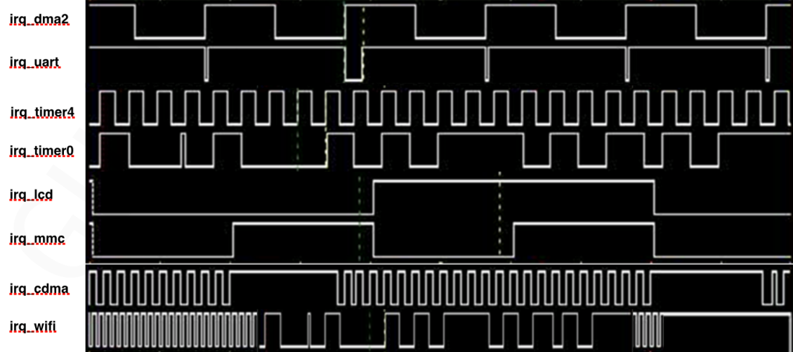
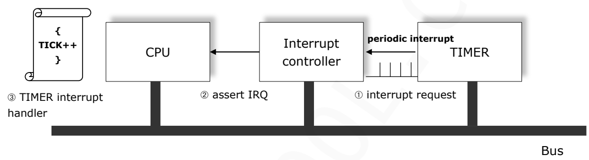

## 1. 인터럽트가 너무 많으면 발생하는 4가지 문제
### (1) 컨텍스트 스위칭 오버헤드 (Context Switching Overhead)

CPU는 인터럽트가 올 때마다 하던 일을 멈추고 현재 상태를 저장한 뒤, 인터럽트 서비스 루틴(ISR)으로 점프해야 한다. 인터럽트가 너무 잦으면 **저장하고 복귀하는 시간**이 **실제 일을 하는 시간**보다 길어지게 된다.
### (2) 인터럽트 지연 (Interrupt Latency) 증가

인터럽트에도 우선순위가 있습니다. 하나를 처리하는 중에 다른 게 또 들어오면 뒤에 온 인터럽트는 기다려야 한다. 이 대기 시간이 길어지면 실시간성이 깨지고, 중요한 신호를 놓치게 됩니다.
### (3) 시스템 라이브락 (Livelock) 현상

시스템이 멈춘 건 아닌데(Deadlock은 아님), CPU 점유율은 100%이면서 정작 유저가 원하는 태스크는 전혀 실행되지 않는 상태이다. 리눅스 커널에서는 이를 **인터럽트 폭풍**이라고 부르며, 마우스 커서도 안 움직이는 먹통 상태가 된다.
### (4) 스택 오버플로우 (Stack Overflow)

특히 FreeRTOS 같은 RTOS 환경에서 위험하다. 인터럽트 내에서 또 다른 인터럽트가 발생하는 **중첩 인터럽트(Nested Interrupt)** 가 계속 쌓이면, 한정된 스택 메모리가 꽉 차서 시스템이 crash 날 수 있다.

<br>

## 2. 지연된 인터럽트(Deferred Interrupt Processing)
>인터럽트 발생 시 **당장 급한 인터럽트**만 ISR(Top Half)에서 처리하고, **시간이 걸리는 나머지 작업**은 나중에(Bottom Half) 처리하도록 예약하는 기법이다.


- 지연된 인터럽트의 동작 방식: CPU가 여유가 생겼을 때 시간이 오래걸리는 작업을 처리한다.
 
<br>
### (1) 상반부 (Top Half - ISR)

- **특징:** 하드웨어 인터럽트가 발생하자마자 즉시 실행된다.
    
- **수행 내용:** 하드웨어 상태를 확인하고, 데이터를 버퍼에 저장하며, 인터럽트 플래그를 클리어하는 등 **최소한의 작업**만 수행한다.
    
- **주의사항:** **실행 시간이 매우 짧아야 하며**, 다른 인터럽트를 차단할 수 있으므로 최소한으로 유지해야 한다. -> 태스크의 우선 순위가 아무리 높더라도 실행하고 있는 ISP 보 먼저 실행될 수 없기 때문이다.
    

### ② 하반부 (Bottom Half - Deferred Task)

- **특징:** Top Half가 끝난 후, CPU가 여유가 생겼을 때 실행된다.
    
- **수행 내용:** 데이터 분석, 네트워크 패킷 처리, 디스크 쓰기 등 **시간이 오래 걸리는 복잡한 작업**을 수행한다.
    
- **이점:** 이 단계에서는 다른 인터럽트를 허용할 수 있어 시스템의 전체적인 실시간 성능이 향상된다.

### 인터럽트 코드 사용방식 비교

```c
수정전(Before) 
volatile char *mdeBuff= (char*)0x75600000; // cdma's buffer __interrupt void cdma_isr(void) 
{ 
. . . . 
	memcpy(mdeBuff, sysmem, 64000); //23ms   
. . . . 
}
```

```c
수정후(After) 
__interrupt void cdma_isr(void) 
{ 
	vTaskResume(task0's handle); 
. . . . 
} 
void task0(void* pdata) 
{ 
. . . . 
	while(1){ 
		vTaskSuspend(NULL); 
		memcpy(mdeBuff, sysmem, 4096*16); // 23ms
. . . . 
	} 
}
```

#### 1. 수정 전 코드의 문제점

수정 전 코드는 인터럽트 핸들러(`cdma_isr`) 내부에서 직접 `memcpy`를 수행한다.

- **인터럽트 점유 시간 과다:** 인터럽트 내에서 64KB의 데이터를 복사하는 데 23ms가 소요된다. 보통 임베디드 시스템에서 1ms도 매우 긴 시간인데, 23ms 동안 ISR에 머물러 있다는 것은 그동안 **다른 모든 인터럽트와 태스크가 실행되지 못하고 차단된다**는 뜻이다.
    
- **시스템 응답성 저하:** 만약 1ms 주기로 처리해야 하는 다른 급한 태스크가 있다면, 이 23ms의 벽에 막혀 실행되지 못하고 데이터 손실이나 시스템 오동작을 유발한다.
    
- **지터(Jitter) 발생:** 인터럽트가 발생할 때마다 시스템이 23ms씩 '얼어붙는' 현상이 발생하여 전체적인 동작이 불안정해진다.

#### 2. 수정 후(After) 코드의 변화 및 장점

수정 후 코드는 인터럽트 처리를 두 단계로 나누는 **Top Half / Bottom Half** 전략을 사용한다.

- **상반부(Top Half - ISR):** `vTaskResume()`을 통해 `task0`를 깨우기만 하고 즉시 종료한다. 이 과정은 매우 짧은 시간(마이크로초 단위) 내에 끝난다. 덕분에 다른 인터럽트들이 다시 동작할 수 있는 상태가 된다.
    
- **하반부(Bottom Half - Task):** 실제 무거운 작업인 `memcpy`는 일반 태스크인 `task0`에서 수행한다.
    
- 이때, task0은 우선순위가 가장 높은 태스크(semi interrupt)이므로, 다른 인터럽트들이 동작 가능하다.