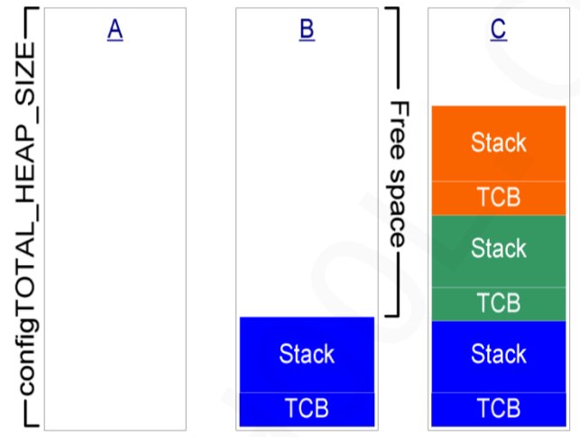
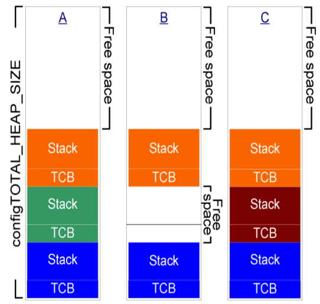
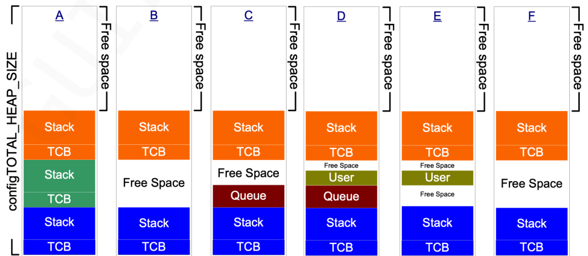

동적 메모리 사용의 문제점
- 메모리 할당 및 해제시 메모리 단편화 현상 발생할 수 있다.
- malloc(), free() 함수의 복잡한 알고리즘에 기인한 수행시간 예측이 어렵다.

FreeRTOS 메모리 관리는 동적 메모리의 할당 해제시 메모리 단편화 현상에 대한 대안이며 5가지의 동적 메모리 방법을 제공한다.

`heap_1.c, heap_2.c, heap_3.c, heap_4.c, heap_5.c`
추천하는 방법은 2번과 4번이다.
- 메모리 단편화 현상이 없어진다. 
- 수행 시간이 일정하다. -> 메모리 단편화 현상이 많이 진행된 이후에는 동적 메모리 할당하는데 걸리는 시간이 길어진다. 
- `pvPortMalloc(), vPortFree()` 함수를 사용한다.

## heap_1.c

- 응용 프로그램이 할당한 메모리는 **할당된 채로 계속 남아 있다.**
- 이 할당 방식은 더 복잡한 메모리 관리 기법을 모두 배제한 방법을 제공한다.
- 태스크나 커널에서 할당한 메모리를 삭제하지 않고 사용해도 된다면, 이 경우 `heap_1`을 사용할 수 있다.
- 힙의 크기는 `configTOTAL_HEAP_SIZE`에 의해 결정된다.

## heap_2.c

- heap_1 과 달리 할당한 메모리를 언제든지 필요할 때 해제할 수 있다.
- 요청한 메모리 사이즈에 가장 맞는 블럭을 할당한다.
- 사용 후 해제된 빈 블럭(free mem)은 다음 요청시 재 사용될 수 있다.
- heap_4와 달리 heap_2는 **인접 자유 블록을 하나의 큰 블록으로 결합하지 않는다**

## heap_3.c

- heap_3.c는 **표준 라이브러리 malloc() 및 free() 함수를 사용**하므로 힙의 크기는 링커 구성 표준에 의해 라이브러리 정의되며 `configTOTAL_HEAP_SIZE` 설정은 힙의 크기에 아무런 영향을 미치지 않는다.
- heap_3 은 일시적으로 FreeRTOS를 정지시킴으로써 malloc() 과 free()를 thread-safe로 만든다.
## heap_4.c

- heap_4 는 heap_2 와 같이 메모리 요청 크기 적합 알고리즘을 사용하여 메모리를 할당한다.
- heap_2와는 달리 heap_4는 메모리의 인접한 블록을 하나의 큰 블록으로 결합하여 메모리 조각화의 위험을 제거한다.

*참고사항:* `ucHeap`배열 사용시 가능한 배열의 시작 주소 설정
- heap_4에서 사용할 배열을 트정 메모리 주소에 배치해야하는 경우가 있다. 예를들면 FreeRTOS 작업에서 사용되는 스택은 힙에서 할당되기 때문에 힙이, 느린 외부 메모리보다는 빠른 내부 메모리에 있어야 하는 경우가 그렇다. 기본적으로 heap_4에서 사용하는 배열은 `heap_4.c` 소스 파일에서 선언된다. 이때, 배열의 시작 주소는 링커에서 자동으로 설정되는데 `configAPPLICATION_ALLOCATED_HEAP` 컴파일 시간 구성 상수가 `FreeRTOSConfig.h`에서 1로 설정되어 있으면 배열이 어플리케이션에서 FreeRTOS를 사용해 선언되어야 한다. 배열이 어플리케이션에서 선언되면 어플리케이션 개발자가 `ucHeap` 시작 주소를 설정할 수 있게 된다. 이를 통해 모든 힙 공간이 내부 메모리로 들어가게 되어 이후 생성되는 태스크 등이 더 빠르게 동작 가능하다. 
## heap_5.c

- 기본적인 메모리 할당 원리 및 방법은 heap_4와 같다.
- heap_4와 달리 heap_5는 여러 개의 정적으로 분리된 메모리 선언된 공간에서 메모리를 할당할 수 있다.
- 사용전 `void vPortDefineHeapRegions(const HeapRegion_t *const pxHeapRegions)` 함수를 먼저 호출해야 한다.