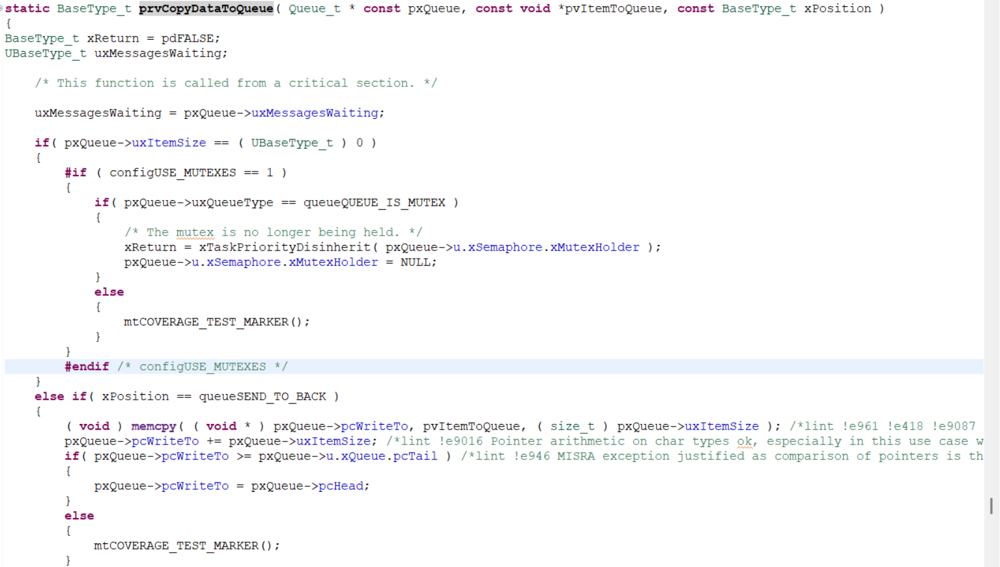

### 1. 메시지 큐란?

메시지 큐는 태스크들이 데이터를 비동기적으로 주고받을 수 있게 해주는 버퍼이다. 데이터를 보내는 측(Sender)은 큐에 데이터를 넣고, 받는 측(Receiver)은 큐에서 데이터를 꺼내간다.

#### 주요 특징

- **FIFO (First-In-First-Out)**: 먼저 들어간 데이터가 먼저 나온다. (단, `xQueueSendToFront`를 통해 새치기가 가능하다.)
    
- **Copy by Value**: 데이터의 주소(포인터)가 아니라 **값 자체를 복사**해서 보관한다.
    
    - 주의사항: 데이터를 복사하면 송신 측에서 변수를 재사용해도 안전하지만, 데이터 크기가 크면 복사 비용(CPU 점유)이 발생하므로 주의해야 한다.
        
- **Blocking 지원**: 큐가 비어있을 때 읽으려고 하거나, 꽉 찼을 때 쓰려고 하면 태스크를 대기(Blocked) 상태로 만들어 CPU 효율을 극대화한다.
    

---

### 2. 핵심 함수 라이브러리 및 원형

#### 함수 라이브러리

`#include “FreeRTOS.h”`
`#include “queue.h”`

#### 주요 함수 요약

| **기능**    | **함수명**                    | **핵심 파라미터**          |
| --------- | -------------------------- | -------------------- |
| **생성**    | [xQueueCreate()](../FreeRTOS_reference_Manual/xQueueCreate().md)         | 큐 길이, 아이템 크기         |
| **전송**    | [xQueueSend()](../FreeRTOS_reference_Manual/xQueueSend(),%20xQueueSendToFront(),%20xQueueSendToBack().md)             | 큐 핸들, 데이터 포인터, 대기 시간 |
| **수신**    | [xQueueReceive()](../FreeRTOS_reference_Manual/xQueueReceive().md)          | 큐 핸들, 버퍼 포인터, 대기 시간  |
| **상태 확인** | [uxQueueMessagesWaiting()](../FreeRTOS_reference_Manual/uxQueueMessagesWaiting().md) | 큐 핸들                 |
| **초기화**   | [xQueueReset()](../FreeRTOS_reference_Manual/xQueueReset().md)            | 큐 핸들                 |

---

### 3. 메시지 큐 사용 시나리오 (Flow)

1. **생성**: `main` 함수나 초기화 태스크에서 `xQueueCreate`를 호출하여 통로를 만든다.
    
2. **전송**: 센서 데이터를 읽는 태스크(송신자)가 `xQueueSend`를 사용하여 큐에 데이터를 넣는다.
    
3. **수신**: 데이터를 처리하거나 화면에 뿌려주는 태스크(수신자)가 `xQueueReceive`를 사용하여 데이터를 가져온다. 이때 `portMAX_DELAY`를 쓰면 데이터가 올 때까지 휴면 상태로 대기한다.
    
4. **삭제/리스트**: 더 이상 필요 없으면 `vQueueDelete`로 삭제하거나, 에러 발생 시 `xQueueReset`으로 비운다.
    

---

### 4. 주의사항 및 실무 팁

- **ISR 내 사용 금지**: `xQueueSend`, `xQueueReceive`는 일반 태스크용이다. 인터럽트 안에서는 반드시 `FromISR`이 붙은 함수를 사용해야 시스템이 뻗지 않는다.
    
- **포인터 전달**: 데이터 크기가 너무 크면(예: 이미지 데이터) 구조체 전체를 복사하는 대신, 데이터가 저장된 **메모리 주소(포인터)**만 큐에 실어 보낸다. (이때 메모리 해제 시점을 잘 관리하는 것이 중요하다.)
    
- **우선순위 역전**: 높은 우선순위 태스크가 낮은 우선순위 태스크가 채워줄 큐를 무한정 기다리게 되면 시스템 병목이 생길 수 있다.
    

---

### 5. 통합 예제 코드

```c
/* 큐를 통해 전달할 구조체 */
typedef struct {
    uint8_t  sensorID;
    uint32_t value;
} SensorData_t;

QueueHandle_t xSensorQueue;

void vSensorTask(void *pv) {
    SensorData_t data = {1, 100};
    while(1) {
        // 큐에 데이터 전송 (100ms 대기)
        if(xQueueSend(xSensorQueue, &data, pdMS_TO_TICKS(100)) == pdPASS) {
            data.value++; 
        }
        vTaskDelay(pdMS_TO_TICKS(1000));
    }
}

void vDisplayTask(void *pv) {
    SensorData_t rxData;
    while(1) {
        // 데이터가 올 때까지 무한 대기
        if(xQueueReceive(xSensorQueue, &rxData, portMAX_DELAY) == pdPASS) {
            printf("Sensor %d: %d\n", rxData.sensorID, rxData.value);
        }
    }
}
```

****

### 6. 메시지 큐의 데이터 복사 방식


`xQueueSendToBack()` -> `xQueueGenericSend()` -> `prvCopyDataToQueue()`로 파고 들어 분석한 결과. `memcpy()`를 통해 데이터를 전송한다는 것을 알게 되었다.
FreeRTOS에서 메시지 큐 복사 방식은 copy by value이므로 데이터를 큐 저장소로 직접 복사하기 때문에 구조체 내에 포인터가 포함된 경우, 주소값만 복사되어 전달될 수 있기 때문에 조심해야한다.