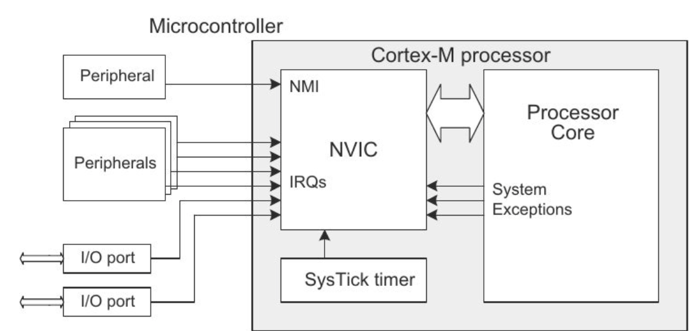

## 1. NVIC (Nested Vectored Interrupt Controller)

- **정의**: 하드웨어 인터럽트의 우선순위를 관리하고 CPU에 전달하는 모듈.
    
- **주요 기능**:
    
    - **Prioritization**: 여러 인터럽트 중 중요한 것을 먼저 처리.
	    MCU에 존재하는 수많은 주변 장치들이 CPU에게 신호를 보낼 때, 누가 더 급한지 순서를 정해 CPU에게 전달한다.
        
    - **중첩 인터럽트(Nested Interrupt)**: 실행 중인 인터럽트를 더 높은 우선순위가 가로챌 수 있음.
        낮은 우선순위의 인터럽트가 처리되던 중에 더 높은 우선순위의 인터럽트가 발생하면, 하던 이를 멈추고 새로운 인터럽트를 즉시 처리할 수 있게 해준다.
        
    - **Vector Table**: 인터럽트 발생 시 실행할 함수의 주소를 관리.
        

## 2. SysTick (System Tick Timer)

- **정의**: OS의 시간 기준을 만들기 위한 24비트 다운 카운터 타이머.
    
- **주요 기능**:
    
    - **Heartbeat**: 일정 시간마다 스케줄러를 호출하는 인터럽트 발생.
        SysTick이 발생할 때마다 스케줄러를 깨워 다른 태스크로 문맥 전환할 타이밍을 정확하게 알려준다.
        
    - **Portability**: ARM Cortex-M 표준 사양으로 모든 칩에서 동일하게 사용 가능.
	    하드웨어 제조사마다 타이머 구조가 다르면 OS 포팅이 어렵기 때문에 Cortex-M 코어에 공통으로 이 SysTick이 들어가 있다. 
	    
- SysTick 인터럽트 역시 NVIC를 통해 관리되는 인터럽트 중 하나이며, 일반적으로 RTOS에서 적절한 우선순위를 할당받아 시스템 운영의 핵심 동력원이 된다.