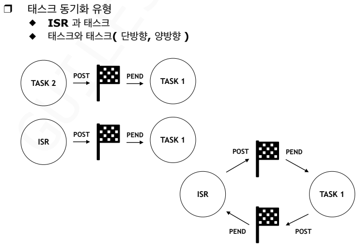

세마포어는 3가지 연산만 가능하다.
### 1. 초기화 연산
>세마포어를 사용하기 전, 공유 자원의 개수에 따라 초기값을 설정하는 단계.

- 이진 세마포어: 초기값을 1로 설정하여 한 번에 하나의 태스크만 접근하게 한다.
- 카운팅 세마포어: 자원이 여러 개일 때 그 개수만큼 초기값을 설정한다.
- 세마포어 변수는 절대로 음의 정수가 될 수 없다.

- FreeRTOS API: `vSemaphoreCreateBinary()` 또는 `xSemaphoreCreateCounting()` 함수를 사용하여 생성과 동시에 초기화합니다.

### 2. P연산
> 자원을 사용하기 위해 검사하고 점유하는 연산이다. 
> <br>(Proberen: 네덜란드어로 테스트하다라는 뜻.)

- 동작원리
	1. 세마포어 값(S)이 0보다 큰지 확인한다.
	2. 값이 0보다 크면 값을 1 감소시키고 자원을 사용한다.
	3. 만약 값이 0이라면, 자원이 생길 때까지 해당 태스크는 blocked 상태로 들어간다.

- FreeRTOS API: `xSemaphpreTake()` 함수가 이 역할을 수행한다.

### 3. V연산
> 자원 사용을 마치고 반납하며 다른 태스크에게 알리는 연산이다.
> <br>(Verhogen: 네덜란드어로 증가시키다라는 뜻.)

- 동작원리
	1. 세마포어 값을 1 증가시킨다.
	2. 만약 자원을 기다리며 대기 중인 태스크가 있다면, 그중 하나를 깨워 Ready 상태로 만든다.

- FreeRTOS API: `xSemaphoreGive()` 함수가 이 역할을 수행한다.

****
<br>

## 세마포어를 활용한 IPC

- 생산자 프로세스: 데이터를 만들어내는 역할
```c
do{
	...
	아이템을 생산한다.
	...
	아이템을 버퍼에 추가한다.
	... 
	버퍼에 아이템이 있다고 알려준다.
	sem_signal(sem);
} while(1);
```
`sem_signal(sem)`: 세마포어 값을 1 증가시킨다. 소비자는 `sem_wait(sem)` 함수를 통해 신호를 받게 되고 깨어난다.

- 소비자 프로세스: 데이터를 사용하는 역할
```c
do{
	버퍼에 아이템이 생길 때까지 기다린다.
	sem_wait(sem);
	...
	버퍼로부터 아이템을 가져온다.
	...
	아이템을 소비한다.
	...
} while(1);
```
`sem_wait(sem)`: 세마포어 값을 확인한다. 만약 0이라면 누군가 신호를 줄 때까지 기다린다. 값이 1 이상이라면 값을 1 감소시키고 다음 줄로 내려간다.

****
## ISR 내부에서 세마포어 사용시 위험성

ISR 내에서 wait 함수를 사용하는 것은 시스템 전체를 멈추게 할 수도 있다.

1. ISR은 blocking을 할 수 없다.
	<br>태스크는 cpu를 쓰다가 잠시 멈추고 나중에 다시 시작할 수 있는 문맥을 가지고 있지만, ISR은 아니다. ISR은 하드웨어 신호에 의해 CPU를 잠시 빌려 쓰는 특수 루틴이다.
	- 만약 ISR에서 wait 함수를 호출했는데 세마포어 값이 0이라면 ISR은 자리가 날 때까지 기다리려 하겠지만, ISR을 관리하는 주체는 태스크 스케줄러가 ㅏㅇ니기 때문에 시스템은 그 상태로 무한대기에 빠진다.

2. 데드락
	<br>만약 어떤 태스크가 세마포어를 잡고 작업을 하던 중 인터럽트가 발생했고 하필 ISR 내에서 똑같은 세마포어를 얻으려고 wait함수를 호출한다면, 태스크는 인터럽트 때문에 멈춰서 신호를 줄 수 없고, ISR은 태스크가 신호를 주기만을 기다립니다. 서로가 서로를 물고 늘어지는 **교착 상태**가 즉시 발생하게된다.

3. **해결책**
	<br>RTOS에서는 이 문제를 해결하기 위해 별도의 인터럽트 전용 API를 제공한다.
	<br>규칙 1: ISR 내에서는 절대 wait함수를 사용하지 않는다. 오직 signal 함수만 사용한다.
	<br>규칙 2: 반드시 이름 뒤에 `FromISR`이 붙은 전용 함수만 사용한다.
	<br>함수 예시: `xSemaphoreGiveFromISR(), xSemaphoreTakeFromISR()`
	
	이 함수들은 내부적으로 Blocking을 수행하지 않으며, ISR이 끝난 직후 스케줄링이 필요한지 여부만 확인하여 안전하게 복귀한다.

****
## 세마포어 함수 모음

[vSemaphoreCreateBinary()](../FreeRTOS_reference_Manual/vSemaphoreCreateBinary().md)
- 이진 세마포어를 사용 가능한 상태(1)로 생성하는 매크로.

[vSemaphoreDelete()](../FreeRTOS_reference_Manual/vSemaphoreDelete().md)
- 더 이상 필요 없는 세마포어를 삭제하여 메모리를 회수하는 함수이며, 반드시 해당 세마포어를 기다리는 
태스크가 없을 때만 호출해야 한다.
- 꼭 필요하지 않다면 삭제하지 않는게 좋다. -> 시스템의 불확정성이 높아진다.

[xSemaphoreTake()](../FreeRTOS_reference_Manual/xSemaphoreTake().md)
- 세마포어를 획득하려고 시도하며, 세마포어가 없다면 지정한 시간(`xTicksToWait`)만큼 대기하는 태스크 전용 함수이다. -> 대기시간동안 신호가 오지 않아도 정해진 시간이 지나면 알아서 휴면상태에서 깨어남

[xSemaphoreGive()](../FreeRTOS_reference_Manual/xSemaphoreGive().md)
- 사용 중이던 세마포어를 반납하여 다른 태스크가 사용할 수 있게 하거나, 대기 중인 태스크에 세마포어 반환을 알리는 역할을한다.

[xSemaphoreTakeFromISR()](../FreeRTOS_reference_Manual/xSemaphoreTakeFromISR().md)
- **인터럽트 발생을 태스크에게 알리기 위해** 신호를 보내는 함수이다.
- 일반 함수와 달리 **대기 시간 설정이 없으며**, 실행 후 더 높은 우선순위 태스크를 바로 깨울지 결정하는 `pxHigherPriorityTaskWoken` 매개변수를 사용한다. -

[xSemaphoreGiveFromISR()](../FreeRTOS_reference_Manual/xSemaphoreGiveFromISR().md)
- ISR 내에서 세마포어 획득을 시도하는 함수이다.
- 인터럽트는 멈출 수 없으므로 **대기 시간 설정이 절대 불가능**하며, 열쇠가 없으면 기다리지 않고 즉시 실패(`pdFAIL`)를 반환한다. (ISR 내에서 Take를 쓰는 경우는 드물다.)

[xSemaphoreCreateCounting()](../FreeRTOS_reference_Manual/xSemaphoreCreateCounting().md)
- 자원의 개수가 여러 개인 상황에서, 그 개수를 세어가며 접근을 제어하는 세마포어를 생성하는 함수이다.

[uxSemaphoreGetCreate()](../FreeRTOS_reference_Manual/uxSemaphoreGetCreate().md)
- 세마포어에 남아있는 현재 세마포어 값을 반환하며, 이진 세마포어는 0 또는 1, 카운팅 세마포어는 0부터 최대값 사이의 값을 가진다.

------

# IPC
> 독립적으로 실행되는 태스크나 ISR이 서로 협력하기 위해 데이터를 전달하거나 상태를 알릴 때 사용한다.

세마포어는 상호배제 뿐만 아니라 태스크 간의 실행 순서를 맞추는 **동기화** 목적으로도 사용된다.

## 주요 통신 방법

1. **전역 변수 이용**
	- **특징:** 메모리 상의 공유 영역을 사용하여 데이터를 직접 읽고 쓴다.
	- **주의사항 및 해결책:** 여러 곳에서 동시에 접근하면 데이터가 깨질 수 있으므로, 세마포어나 뮤텍스를 사용한 **독점적 엑세스 보장**이 필수적이다.
2. **메시지 전송**
	- **특징:** OS가 관리하는 별도의 통로를 통해 데이터를 안전하게 보낸다.
	- **종류:** 
		1. **메시지 메일박스**: 
		- **정의**: 두 태스크 또는 ISR-태스크 간에 '단일 메시지'를 교환하는 IPC 기법이다.
		- **특징**:
		    - 용량이 **1개**로 제한된다.
		    - 주로 데이터의 **포인터**를 전달하여 효율성을 높인다.
		    - 수신 태스크는 메시지가 올 때까지 **Blocking** 대기 가능하다.
		- **주요 함수 (일반적인 RTOS 기준)**:
		    - `OSMboxPost()`: 메시지 전송
		    - `OSMboxPend()`: 메시지 수신 (데이터가 올 때까지 대기)
		      
		1. **메시지 큐:**
		- **정의:** 두 태스크 또는 ISR-태스크 간에 **여러 개의 메시지**를 순차적으로 교환할 수 있도록 OS가 관리하는 버퍼 기반의 IPC 기법이다.		
		- **특징:**
			- **FIFO (First-In, First-Out)**: 먼저 들어온 데이터가 먼저 나가는 줄 세우기 방식이 기본이다.
			- **용량(N개)**: 메일박스와 달리 여러 개의 데이터를 담을 수 있는 저장 공간이 있어, 일시적으로 데이터가 몰려도 잃어버리지 않고 보관할 수 있다.
		- **동기화 지원**:
		    - **수신측**: 큐가 비어있으면 데이터가 들어올 때까지 **Blocking** 상태로 기다릴 수 있다.
		    - **송신측**: 큐가 가득 차 있으면 빈 자리가 생길 때까지 기다리도록 설정할 수 있다.
		- **복사 방식 vs 포인터 방식**:
		    - 데이터 자체를 복사해서 전달하거나, 큰 데이터의 경우 주소만 전달하여 효율을 높인다.
		
		- **주요 함수 (FreeRTOS / 일반 RTOS 기준)**
			- `xQueueCreate()` / `OSQCreate()`: 지정된 개수와 크기만큼의 메시지 큐 생성.
			- `xQueueSend()` / `OSQPost()`: 큐에 데이터를 집어넣기 (보내기).
			- `xQueueReceive()` / `OSQPend()`: 큐에서 데이터를 꺼내오기 (받기).

## 태스크 동기화(Task Synchronization)




### 1. 일방향 동기화 (Unilateral Synchronization)

한 태스크가 다른 태스크에게 **특정 사건이 발생했음을 알리는** 방식이다.

- **동작 원리**:
    
    - **태스크 A**가 작업을 마치고 작업이 끝났다는 신호를 보낸다.
        
    - **태스크 B**는 그 신호가 올 때까지 기다리고 있다가, 신호를 받으면 즉시 다음 작업을 수행한다.
        
- **사용 도구**: 주로 **Binary Semaphore**를 사용한다.
    
- **ISR->TASK:** 인터럽트가 발생하면 ISR이 실행되고, ISR은 태스크에게 신호를 보낸 뒤 바로 종료한다.
---

### 2. 양방향 동기화 (Bilateral Synchronization / Rendezvous)

두 태스크가 **서로의 작업이 특정 지점까지 완료될 때까지 기다리는** 방식이다. 이를 '랑데부(Rendezvous)'라고도 부른다.

- **동작 원리**:
    
    - 태스크 A와 태스크 B가 각자 일을 한다.
        
    - 두 태스크 모두 Sync Point에 도착해야만 다음 단계로 넘어갈 수 있다.
        
    - 만약 태스크 A가 먼저 도착하면, B가 올 때까지 그 자리에서 기다린다.
        
    
- **사용 도구**: 두 개의 세마포어를 서로 엇갈리게 사용하거나, FreeRTOS의 **Event Groups** 기능을 주로 사용한다.
	
- **ISR<->TASK:** ISR은 blocking 상태에 빠지면 안되기 때문에 양방향 동기화는 불가능하다. 대신 ISR이 태스크에게 신호를 주면 태스크가 변수나 플래그를 업데이트하고 ISR은 다음 인터럽트에 그 변수나 플래그의 상태를 확인하는 식으로만 가능하다.


