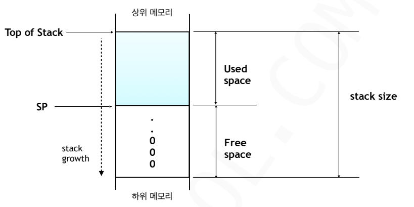
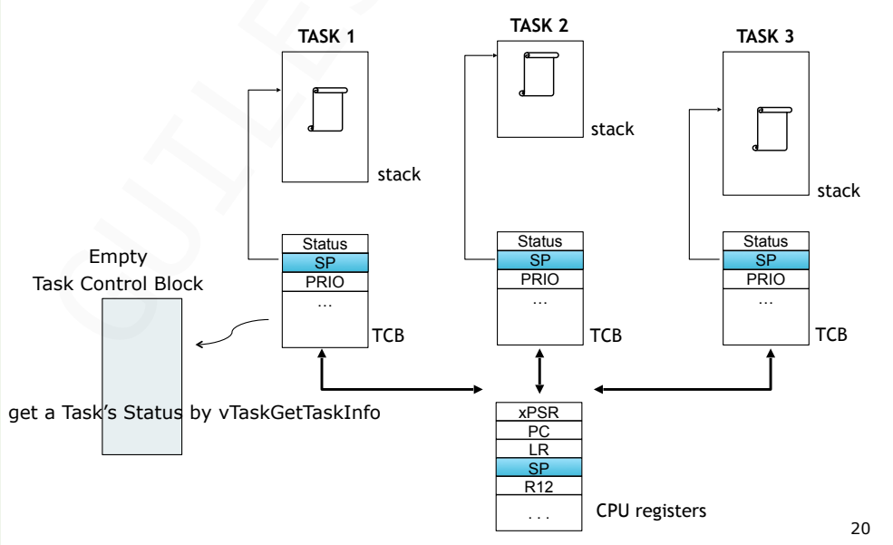

## Task와 스택 메모리
- task stack memory는 정적, 동적 할당 사용 가능
- 동적 메모리 사용은 [메모리 단편화] 현상이 발생하지 않도록 응용프로그램이 일단 한 번 생성한 태스크는 프로그램 종료까지 삭제하지 않고 유지하는 경우에만 사용하는 것이 바람직하다.
- task stack의 크기는 응용 프로그램마다 다르다.
- task stack의 크기를 결정하는 요소들
	- task에서 호출하는 함수들의 중복 호출 횟수
	- 해당 함수에서 사용되는 모든 지역변수의 개수
- 동적 메모리를 이용한 태스크 스택의 생성
```c
#define configSUPPORT_DYNAMIC_ALLOCATION 1
TaskHandle_t xTaskCreateStatic(TaskFunction_t pxTaskCode,..)
함수를 이용하여 태스크 생성 -> 개발자가 직접 메모리 핟당
```
- 정적 메모리를 이용한 태스크 스택의 생성과 그 실행
```c
#define configSUPPORT_STATIC_ALLOCATION 1
BaseType_t xTaskCreate(TaskFunction_t pxTaskCode,..)
함수를 이용하여 태스크 생성 -> 메모리 할당을 커널이 알아서 수행
```

### stack 메모리 크기 최적화

- Fill zero: 0의 pattern이 stack의 마지막부터 어디까지 발견되는지 확인만하면 task가 stack의 메모리를 어디까지 사용했는지 알 수 있다. (이를 통해 stack 사용량을 알 수 다.)
- stack overflow 검출방법: 사용하기 전에 stack 메모리에 특별한 문자 패턴을 넣어둔다.(ex. 0x5A 0x5A) 검사 시에 마지막 공간에 0x5A가 아닌 다른 숫자들이 오면 스택 메모리가 다 사용되었다고 판단한다. 그런데 상시 확인이 아닌 **문맥 전환** 작업 시에만 확인하기 때문에 이미 stack overflow가 충분히 진행되었음에도 발생시점을 정확히 파악할 수 없다.

### 런타임 스택 검사 방법 2가지

(1) `#define configCHECK_FOR_STACK_OVERFLOW 1`
- `config_CHECK_FOR_STACK_OVERFLOW`가 1로 설정 되어있고, 스택 포인터가 유효한 범위를 벗어난 스택 공간 내에 있는 것이 실시간으로 확인되면 사용자가 미리 정의한 hook 함수가 호출된다.
- 속도는 빠르지만 문맥전환시에 스택 오버플로우를 검사하는 방식이므로, 이외의 시간에 발생할 수 있는 스택 오버플로우는 찾아내지 못할 수 있다.
- 후크 함수의 예
```c
void vApplicationStackOverflowHook(TaskHandle_t xTask, char *pcTaskName)
{
	configASSERT((volatile void *) NULL);
}
```

(2) `#define configCHECK_FOR_STACK_OVERFLOW 2`
- 태스크가 생성되면 스택 공간을 알려진 0(zero) 패턴으로 덮어 채운다.
- 이 방법은 유효한 스택내 패턴 정보 20바이트를 테스트한다. 20 바이트 중 하나라도 변경된 경우, overflow hook 함수가 호출된다.
- 스택 검사 방법 (1)에 비해 속도는 다소 느리지만, 보다 정확하게 스택 오버플로우를 찾아 낼 수 있다.
- 후크 함수의 예
```c
void vApplicationStackOverflowHook(TaskHandle_t xTask, char *pcTaskName)
{
	configASSERT((volatile void *) NULL);
}
```

****
## 메모리 단편화
>메모리 공간이 작은 조각으로 나뉘어 있어, 전체 가용 공간은 충분함에도 불구하고 필요한 크기의 메모리를 할당하지 못하는 상태이다.

### 메모리 단편화의 종류
#### 1. 외부 단편화
- **정의:** 메모리 할당과 해제가 반복되면서, 중간중간 사용하지 않는 작은 빈 공간들이 생기는 현상이다.
- **문제점:** 빈 공간들의 합계는 요청한 크기보다 크지만, 공간들이 연속적이지(Contiguous) 않아서 할당이 불가능해진다.
- **예시:** 10KB가 비어있는데, 5KB, 2KB, 3KB로 쪼개져 있다면 7KB 할당 요청을 처리할 수 없다.
#### 2. 내부 단편화 (Internal Fragmentation)
- **정의:** 메모리 할당 시 하드웨어나 관리 시스템의 효율을 위해 고정된 크기(예: 4KB Page)로 할당할 때, 실제 요청한 크기보다 더 큰 메모리가 할당되어 내부 공간이 낭비되는 현상이다.
- **문제점:** 할당된 블록 내부에 남는 공간은 다른 프로세스가 사용할 수 없어 메모리 낭비가 발생한다.
- **예시:** 4KB 단위로 메모리를 할당하는 시스템에서 1KB만 요청해도 4KB가 할당되므로, 내부적으로 3KB의 낭비가 생긴다.
### 해결책
### 1. 가급적 처음부터 크게 할당하는 방법 (Memory Pooling)
>**'Memory Pool'** 또는 **'Static Allocation'** 기법이라고 부른다.

- **핵심 개념**: 필요한 최대 메모리 크기를 미리 예측하여, 프로그램 시작 시점에 거대한 배열 형태로 미리 잡아두는 방식이다.
    
- **장점**:
    - **외부 단편화 제로**: 메모리를 줬다 뺏다(Alloc/Free) 하지 않고 큰 덩어리를 고정해서 쓰기 때문에 조각이 날 일이 없다.
        
    - **결정성(Determinism) 보장**: 할당에 걸리는 시간이 일정하여 실시간 시스템에 유리하다.
        
- **단점**:
    - **내부 단편화 발생**: 실제로 10KB만 써도 미리 100KB를 잡아뒀다면 나머지 90KB는 낭비된다.
        
- **FreeRTOS**: `xTaskCreateStatic()` 함수를 사용하면 스택 공간을 힙이 아닌 정적 배열로 할당할 수 있다.

### 2. 부팅하자마자 미리 Task를 생성/할당하는 방법 (Pre-allocation)
>**'Initialization Phase Allocation'** 전략이라고 부른다.

- **핵심 개념**: 런타임에는 Task를 생성하거나 삭제하지 않고, `main()` 함수에서 스케줄러가 돌기 전에 필요한 모든 자원을 다 만들어두는 방식이다.
    
- **장점**:
    - **안정성**: 만약 메모리가 부족하다면 부팅 직후에 바로 알 수 있어, 운영 중에 갑자기 메모리 부족으로 시스템이 뻗는 '런타임 에러'를 방지할 수 있다.
        
    - **파편화 억제**: task를 동적으로 생성/삭제할 때 발생하는 '메모리 구멍' 현상을 원천 차단한다.
        
- **단점**:
    - 초기 부팅 시간이 약간 길어질 수 있고, 사용하지 않는 Task도 메모리를 계속 점유하게 된다.
        
- **실제 사례**: 항공, 자동차 등 미션 크리티컬한 시스템에서는 운영 중 `vTaskDelete()`나 `malloc()` 사용을 아예 금지하기도 한다.

****
## TCB(Task Control Blcok)
>TCB는 태스크의 모든 정보를 담고 있는 block이다.

FreeRTOS에서 태스크를 생성하면, 커널은 이 태스크를 관리하기 위해 메모리에 TCB라는 구조체를 하나 만든다.
- TCB의 역할: 태스크의 이름, 우선순위, 현재 상태, 그리고 가장 중요한 **스택 포인터** 정보를 저장한다.
### TASK의 정보 얻어오기 

- context는 TASK의 stack 메모리 안에 저장된다(context는 CPU 레지스터)
	context는 CPU가 일을 하다가 멈춘 순간의 정보의 복사본이다.
- cpu register: 현재 계상 중인 값, PC, SP등을 담고 있다.

#### context switching
> 태스크 A를 멈추고 태스크 B를 실행하기 위한 전체 과정(저장 + 교체 + 복원)

- **Context 저장 (Save)**: 현재 실행 중인 태스크 A의 레지스터 값(Context)을 태스크 A의 스택에 저장하고, TCB에 그 위치를 기록한다.
    
- **태스크 교체 (Selection)**: 스케줄러가 다음 순서를 결정하고, 다음 순서인 태스크 B의 TCB를 가져온다. 
    
- **Context 복원 (Restore)**: 태스크 B의 TCB에 적힌 스택 위치로 가서, 예전에 저장해뒀던 값들을 CPU 레지스터에 다시 로드한다. 

한 줄 요약: TCB는 각 태스크의 우선순위와 스택 포인터를 포함한 모든 상태 정보를 저장하여, CPU가 작업을 중단 했거나 나중에 정확히 그 지점부터 다시 실행할 수 있게 해주는 태스크 전용 업무 일지이다.